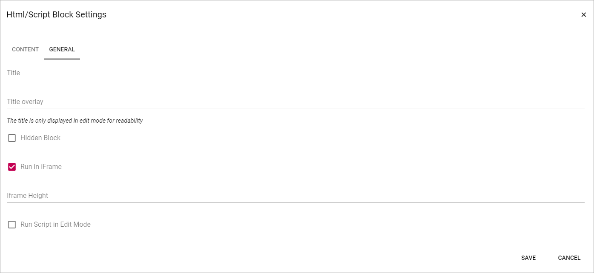

HTML/Script
===========================================

HTML/Script is a block you can use for various applications to add extra functionality or content to a page. One example is to add the code for a video, from YouTube, or some other source.

To add HTML code, click "ADD CONTENT".

.. image:: html-add-content.png

When you click "ADD CONTENT" the following is shown:

.. image:: html-script-editing.png

+ **HTML**: Add HTML here.
+ **CSS**: To set CSS for the content in this field, add it here.
+ **Javascript**: If Javascript is needed/used, add it here.

General settings
*****************
The following settings are available when editing HTML/Script:

+ **Title**: Add a title for the contents in the field, if needed.
+ **Title Overaly**: If a Title Overlay is needed, add it in this field.
+ **Hidden block**: Id the block for some reason should be hidden in reader mode (end user mode), select this option.
+ **Run in iFrame**: Per default, the HTML/Script you add here are run in iFrame. If needed this option can be deselected.
+ **iFrame Height**: If "Run in iFrame" is selected you can set the iFrame Height.
+ **Run Script in Edit Mode**: If the script should be run in reader mode (end user mode) only, select this option.
