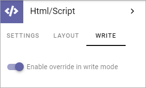
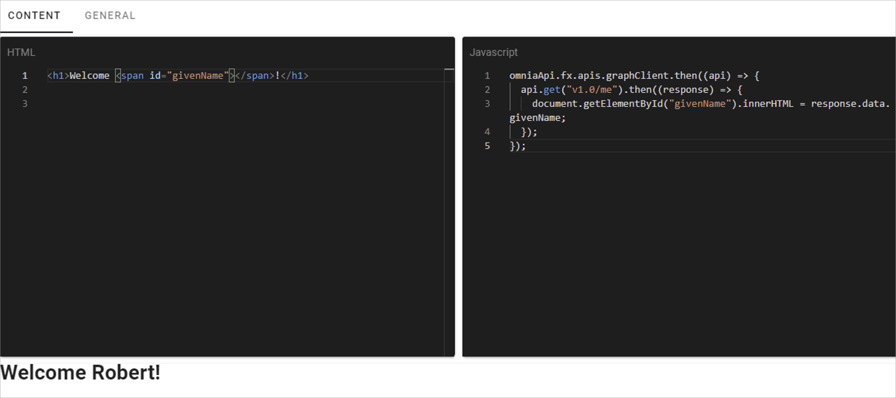

HTML/Script
===========================================

HTML/Script is a block you can use for various applications to add extra functionality or content to a page. One example is to add the code for a video, from YouTube, or some other source.

Block Settings
***************
The following settings are available for teh block:

.. image:: html-settings-new.png

Settings
------------
On this tab you can choose to add some default content to the block. You can also use the WRITE tab to set if it should be possible to edit the default content, see below.

To add default content, click ADD CONTENT.

The following is shown:

.. image:: html-settings-new2.png

You use it the same way as is described under *Add HTML Code*, below.

Layout
-------
The LAYOUT tab contains general settings, see: :doc:`General Block Settings </blocks/general-block-settings/index>`

Write
------
Using the WRITE tab you can set the following:

If it should be possible for editors to replace or remove the default content in the block, this option should be on (default). If not, click to set it to off.

Add HTML code
****************
Note that if any default content is added, and if editing is not allowed as set on the WRITE tab (see above) nothing can be added or edited in Write mode. 

To add HTML code in Write mode, if it is allowed, click "ADD CONTENT". 

.. image:: html-add-content-new.png

When you do the following is shown:

.. image:: html-settings-new2.png

+ **HTML**: Add HTML here.
+ **CSS**: To set CSS for the content in this field, add it here.
+ **Javascript**: If Javascript is needed/used, add it here.

General settings
-------------------
The following settings are available when editing HTML/Script:

.. image:: html-script-general-new.png

+ **Title**: Add a title for the contents in the field, if needed.
+ **Title Overaly**: If a Title Overlay is needed, add it in this field.
+ **Hidden block**: Id the block for some reason should be hidden in reader mode (end user mode), select this option.
+ **Run in iFrame**: Per default, the HTML/Script you add here are run in iFrame. If needed this option can be deselected.
+ **iFrame Height**: If "Run in iFrame" is selected you can set the iFrame Height.
+ **Run Script in Edit Mode**: If the script should be run in reader mode (end user mode) only, select this option.

Omnia 6.5 and later
*************************
In Omnia 6.5 and later, the HTML/Script block is improved to support api endpoints to the Microsoft Graph and SharePoint REST API. This will make it possible to get data from the Graph and render it using the built-in vue.js framework in Omnia.

