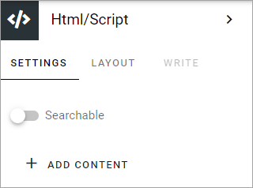

HTML/script
===========================================

HTML/script is a block you can use for various applications to add extra functionality or content to a page. One example is to add the code for a video, from YouTube, or some other source.

Block settings
***************
The following settings are available for the block:

+ **Searchable**: I you would like the content in this field to be searchable, select this option (available in Omnia 7.5 and later).
+ **ADD CONTENT**: You can choose to add some default content to the block. Content can also be edited and added using Write mode.

To add default content, click ADD CONTENT.

The following is shown:

.. image:: html-settings-new2.png

You use it the same way as is described under *Add HTML code*, below.

Layout and Write
------------------
The LAYOUT tab contains general settings, see: :doc:`General block settings </blocks/general-block-settings/index>`

The WRITE tab is not used for this block.

Add HTML code
****************
To add/edit HTML code in Write mode, click ADD CONTENT. 

When you do the following is shown:

.. image:: html-settings-new2.png

+ **HTML**: Add HTML here.
+ **CSS**: To set CSS for the content in this field, add it here.
+ **Javascript**: If Javascript is needed/used, add it here.

The HTML/script block supports api endpoints to the Microsoft Graph and SharePoint REST API. This will make it possible to get data from the Graph and render it using the built-in vue.js framework in Omnia.

Here's an example:

.. image:: script-html-new-api1-edited.png

General settings
-------------------
The following settings are available when editing HTML/Script:

.. image:: html-script-general-new.png

+ **Title**: Add a title for the contents in the field, if needed.
+ **Title overaly**: If a title overlay is needed, add it in this field.
+ **Hidden block**: Id the block for some reason should be hidden in reader mode (end user mode), select this option.
+ **Run in iFrame**: Per default, the HTML/script you add here are run in iFrame. If needed this option can be deselected.
+ **iFrame height**: If "Run in iFrame" is selected you can set the iFrame height.
+ **Run script in edit mode**: If the script should be run in reader mode (end user mode) only, select this option.

Using the HTML/script block on a section tab
****************************************************
There is a known problem that may occur when using this block on a section tab. You may have to disable lazy load, or the block won't work. This will eventually be fixed, but, for now, if you encounter this problem, simply disable lazy load. And to make sure, disable lazy load on all sections on the same levels as well, even if they don't contain HTML/script block.

This settings is found under "Advanced" in the settings for the section. For more information, see: :doc:`Settings for sections </pages/page-types/section-settings/index>`

