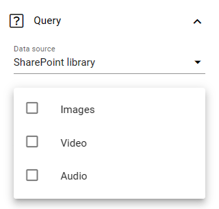

Media rollup
========================

This is a new block in Omnia 7.6. The purpose is to rollup different types of media resources for easy access.

The documentaiton is just started. More details for the descriptions will be added soon.

The following settings are available:

.. image:: media-rollup-settings.png

General
---------
Add a title for the block, if necessary.

.. image:: media-rollup-settings-general.png

Query
-------
Here you select the data source for the rollup.

.. image:: media-rollup-settings-query.png

It can be a SharePoint library or you can use SharePoint search.

For "Sharepoint library" you select to rollup any combination of images, video or audio files.

and set a path to a library.

If you select "Sharepoint search", you start by selecting to rollup any combination of images, video or audio files - and then you can add a query:

.. image:: media-rollup-settings-query-search.png

Display
-----------
For display, you can choose list view or photowall. For list view you must add at least one column for the rollup to work, and use these settings:

.. image:: media-rollup-settings-displat-list.png

For photowall, these settings are avilable:

.. image:: media-rollup-settings-display-photowall.png

Here's an example of a photowall display with three columns:

.. image:: media-rollup-settings-display-photowall-example.png

Filter
----------
For filtering, common options are available. See this page for more information: :doc:`Filter options for blocks </blocks/general-block-settings/filter-options-block/index>`

Style
------------
Under "Style", you can set some padding.

.. image:: media-rollup-settings-style.png

Layout and Write
******************
The Write tab is not used here. The Layout tab contains general settings for blocks. For more information see: :doc:`General block settings </blocks/general-block-settings/index>`

