Media rollup
========================

This is a new block in Omnia 7.6. The purpose is to rollup different types of media resources for easy access, mainly for end users, but can also be configured to be of use for editors, for example if official images are located somewhere else than in any of the Central media locations.

**The documentation is just started with a preliminary description. More will be added soon.**

Settings
***********
The following settings are available:

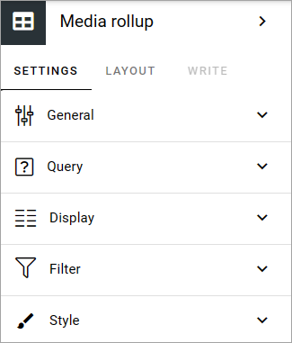

General
---------
Add a title for the block, if necessary.

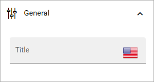

Query
-------
Here you select the data source for the rollup.

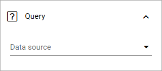

You can rollup media files from a SharePoint library or you can use SharePoint search.

In both cases, start by selecting to rollup images, video or audio.

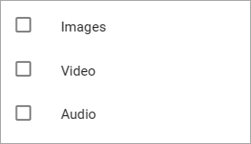

Media files from a SharePoint library
---------------------------------------
The next step for a Sharepoint library is to add a path to the library, or just accept the default path (more info about this soon).

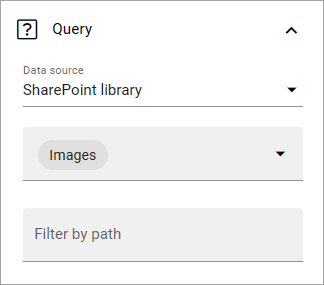

Media files through SharePoint search
-------------------------------------------
For SharePoint search you can add a query the same way as for many other blocks in Omnia:

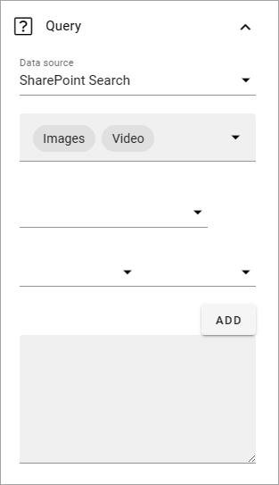

Display
-----------
For display, you can choose a list view or a photowall view. For "List view" you must add at least one column for the rollup to work, and use these settings:

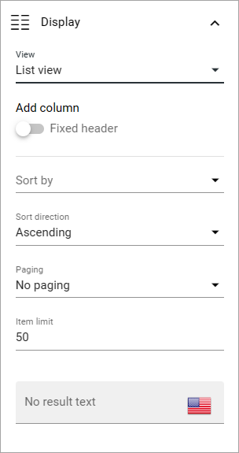

If you select "Fixed header", the header is always shown when users scroll the list.

The rest of the options should be self explanatory.

**A tip!** If you would like to make it possible to download the media files in the list, there's a "Download" column you can add.

Here's a simple example of a list with a small preview and a download icon:

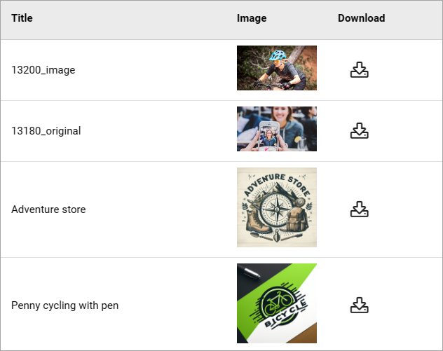

For photowall, these settings are avialable:

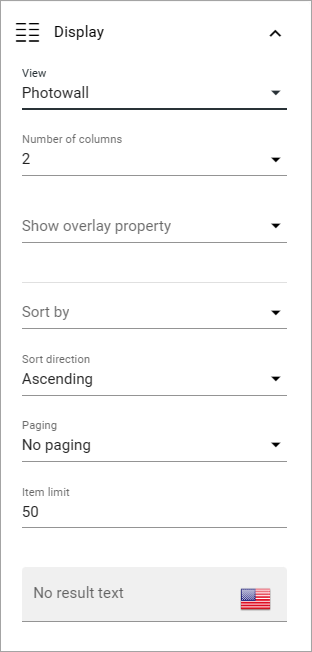

Here's an example of a photowall display with three columns:

For a larger view, click a file. The media list can then be browsed this way:

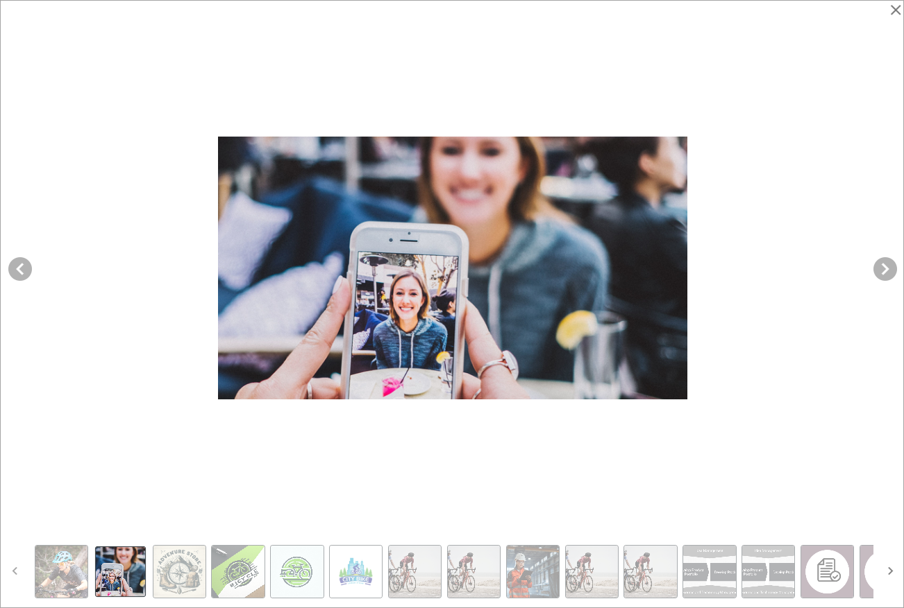

Filter
----------
For filtering, common options are available. See this page for more information: :doc:`Filter options for blocks </blocks/general-block-settings/filter-options-block/index>`

Style
------------
Under "Style", you can set some padding.

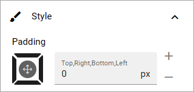

Layout and Write
******************
The Write tab is not used here. The Layout tab contains general settings for blocks. For more information see: :doc:`General block settings </blocks/general-block-settings/index>`

