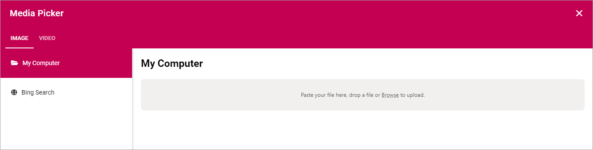
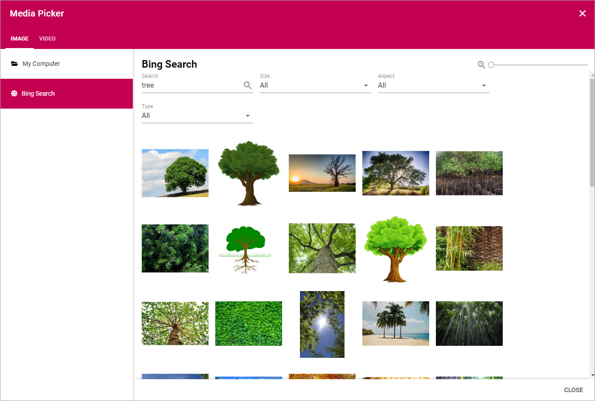
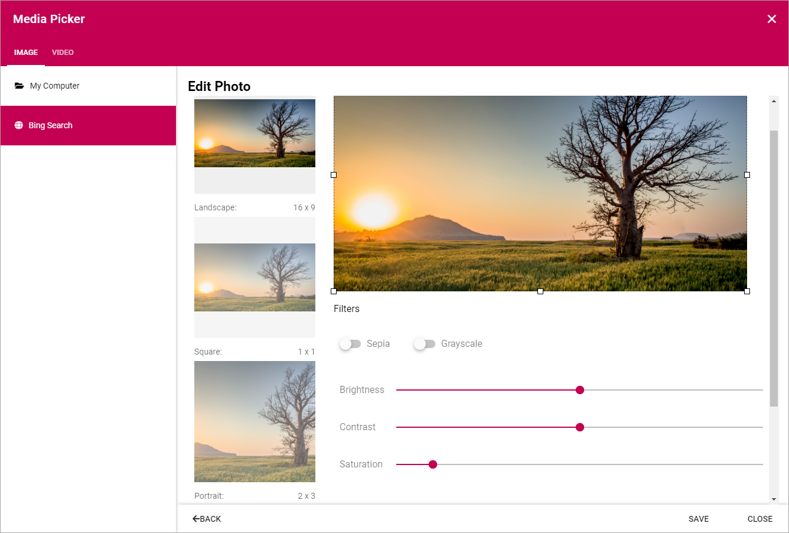
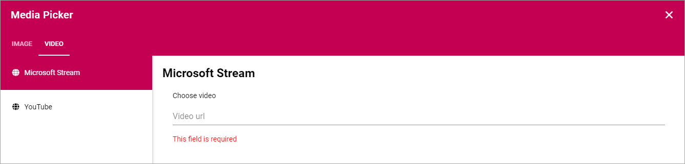

Media
===========================================

Use the Media block to add an image or a video anywhere on a page. 

To add the image or video, click "ADD IMAGE".

.. image:: media-block.png

You then use the Media Picker to select image or video. See this page for more information about the Media Picker: :doc:`The Media Picker </tenant-administration/targeting-definitions/index>`

You can select a photo from your computer or do a Bing search. When using the Bing Search you simply type a search word and can then refine your search.

When you have selected an image, you can customize which part of the image to show, by using the squares to drag the borders of the image. You can also use the filters "Sepia" and "Grayscale" for image effects. Besides that you can edit the image by using the sliders "Brightness", "Contrast" and "Saturation".

You can add a video for the banner, instead of an image, either from your company's local Steam area, or from YouTube. Find the url for the video, copy it and paste in the field.

When you have selected a video, you can set the following:

.. image:: media-picker-video-settings.png

You can set where in the video it should start playing with the format minutes:seconds, for example 1:02 will start the video 1 minute and 2 seconds into the video. You can also set if the video will start automatically (Autoplay) and if information about the video should be shown.

