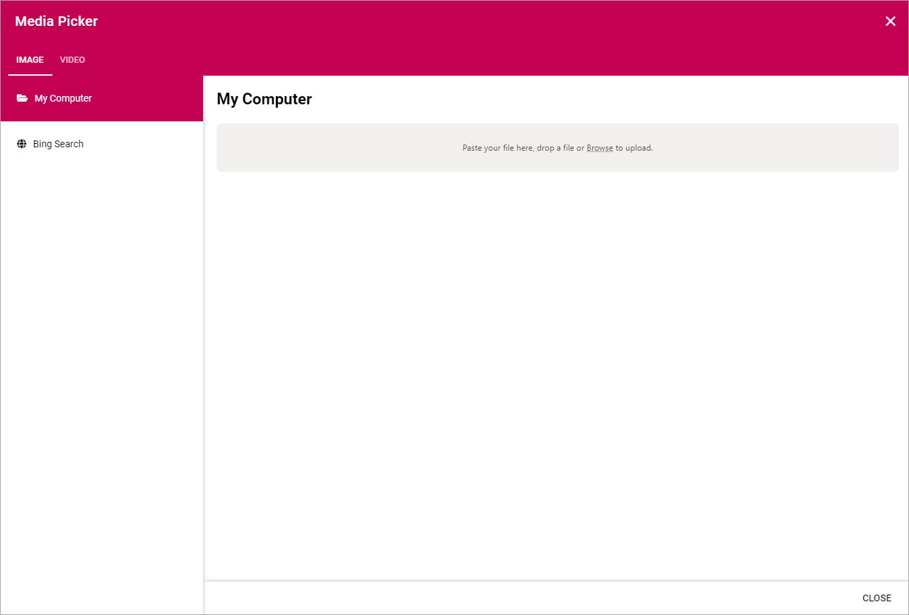

Media
===========================================

Use the Media block to add an image or a video anywhere on a page. 

To add the image or video, click "ADD IMAGE".

.. image:: media-block.png

You then use the Media Picker to select image or video. 

See this page for more information: :doc:`The Media Picker </general-assets/media-picker/index>`

Layout and Advanced
**********************
The tabs Layout and Advanced contain general settings, see: :doc:`General Block Settings </blocks/general-block-settings/index>`