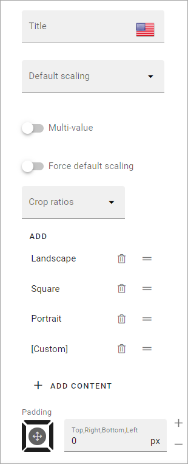
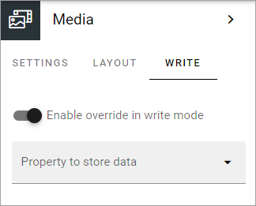
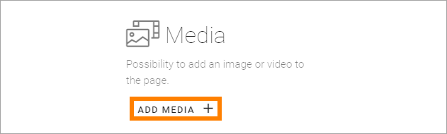
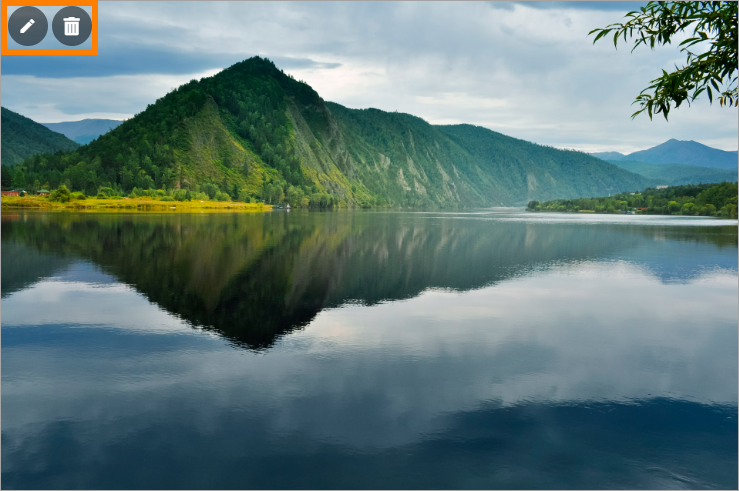

Media
===========

Use the Media block to add an image or a video anywhere on a page. The following file types can be used for images: tiff, pjp, pjpeg, jfif, tif, gif, svg, bmp, png, jpeg, svg, jpg, webp, ico, xbm, dib.

You can also add default content (image or video) to the block and set if it should be possible to edit the default content or not.

Settings
***************
The following settings are available (expand General to see them):

+ **Title**: If a title should be shown for the block, add it in this field. 
+ **Default scaling**: You can select a default scaling here, but if you don't force (se below) this can be changed when an image is added. Possible scalings are set up in Omnia admin.
+ **Multi-value**: If it should be possible to show more than one media item in the block, select this option and use the slider to set the maximum number.
+ **Force default scaling**: Use this setting to see to that all images are scaled the same when they are added - using the default scaling. With this option selected, page editors and authors can not select scaling and the dialog "This image has a bigger file size than recommended" is not shown.
+ **Crop ratios**: Use this list to set up which crop ratios editors should be able to choose from in this block. For more information, see below.
+ **ADD CONTENT**: Click here to add deafalt content to the block. Also see below.
+ **Padding**: You can add some space between the block's borders and the content, if needed.

Set crop ratios
---------------------
Available crop ratios are set up in Omnia admin. Here you can decide which of these should be available to choose from in this block.

.. image:: media-block-crop-ratios.png

To add a crop ratio, open the list and click ADD. To delete a crop ratio, click the dust bin.

Besides that, you can set the order, by grabbing this icon and use drag and drop:

.. image:: media-block-crop-ratios-order.png

Add default content
---------------------
When you click ADD CONTENT the media picker starts and you use it to add an image or a video.

See this page for more information on how to use the media picker: :doc:`The media picker </general-assets/media-picker/index>`

You can use the WRITE tab to set if editors should be able to edit the default content or not, see below.

Layout
**********
The LAYOUT tab contains general settings, see: :doc:`General block settings </blocks/general-block-settings/index>`

Write
******
Using the WRITE tab you can set the following:

+ **Enable overwrite in Write mode**: If it should be possible for editors to replace or remove the default content in the block, this option should be on. If not, off.
+ **Property to store data**: Select property be used in this block. When one block on the page has data connected to a property, that data can be reused in all blocks that uses the same property. Page scoped. Not mandatory.

Add a video or an image in Write mode
*****************************************
To add an image or a video in Write mode, click "ADD MEDIA".

You then use the media picker to select image or video. See this page for more information: :doc:`The media picker </general-assets/media-picker/index>`

Edit or remove video or image
********************************
When any media is present in the block, it may be possible to edit the block in Write mode, depending on settings, see above. If it is allowed, use these icons:

Click the pen to select another image or video using the media picker. Click the dust bin to remove.
