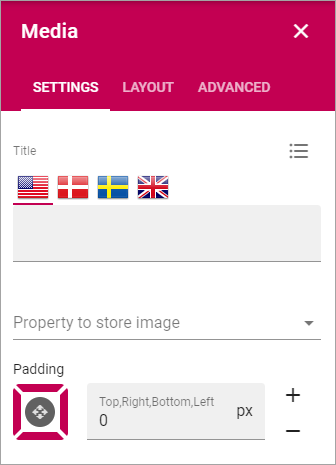
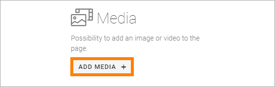
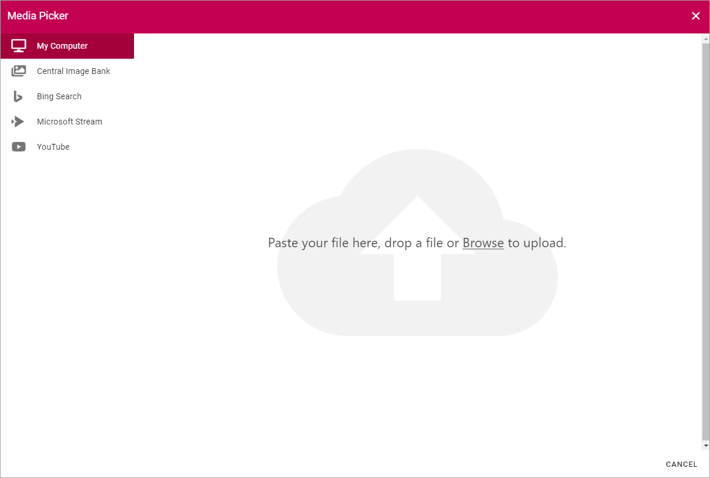

Media
===========================================

Use the Media block to add an image or a video anywhere on a page. 

Settings
***************
The following settings are available:

+ **Title**: If a title should be shown for the block, add it in this field. If no variation exists for the page, it looks like in the image above and you can set the title in the languages active in the tenant. If one or more varitions exists, only one title can be set. In that case, titles in other languages are set in the variations.
+ **Property to store data**: Select Property be used in this block. When one block on the page has data connected to a Property, that data can be reused in all blocks that uses the same Property. Page scoped. Not mandatory.
+ **Padding**: You can add some space between the block's borders and the content, if needed.

The tabs Layout and Advanced contain general settings, see: :doc:`General Block Settings </blocks/general-block-settings/index>`

Add video or image
********************
To add the image or video, click "ADD IMAGE".

You then use the Media Picker to select image or video. 

See this page for more information: :doc:`The Media Picker </general-assets/media-picker/index>`

Add or remove video or image
*****************************
When any media is present in the block, the block can be edited in Write mode, using the icons:

.. image:: media-block-edit.png

Click the pen to select another image or video using the Media Picker. Click the dust bin to remove.