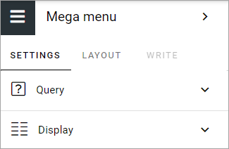
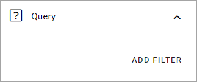
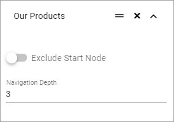
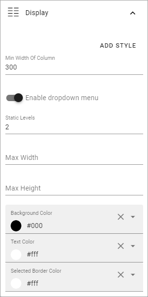
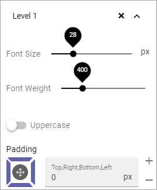

Mega menu
=====================

This block most likely has it's main use as a part of the Workspace functionality, but can also be added to any page or page type, if needed.

You can find more information about the Workspace functionality here: :doc:`Workspace </admin-settings/business-group-settings/workplace/index>`

Settings
***********
These settings are available:

Query
----------
Here you can set the following:

1. Click ADD FILTER to add pages to the mega menu, and the page picker opens. Use it as is described here: :doc:`The page picker </general-assets/page-picker/index>`

If you select a top node, all sub pages to that node are also selected.

2. Set the following:

+ **Exclude start node**: If the start node in what you have selected should not be used, activate this option.
+ **Navigation depth**: Set the number of levels that should be shown.

When you have added several objects to the mega menu this way, you can grab the left-most icon and use drag and drop to edit the order.

Display
------------
The following is available here:

+ **ADD STYLE**: Click here for some style settings. See below for more information.

+ **Min width of column**: Set the minimum width of columns in the mega menu here.
+ **Enable dropdown menu**: If you disable this, all menu options, wihin the navigation depth you have decided, will always be shown.
+ **Static levels**: Defines the number of levels that will always be displayed in the menu.
+ **Max width**: As default, the menu's width is dynamic, meaning it adapts to the width needed. You can set a fixed width in pixels if you wish.
+ **Max height**: As default, the menu's height is dynamic, meaning it adapts to the height needed. You can set a fixed height in pixels if you wish.
+ **Background color**: As default, the background color for the mega menu is the same as the header, but you can set another background color if you wish.
+ **Text color**: As default, the text color for the mega menu is the same as the text in the header, but you can set another text color if you wish.
+ **Selected border color**: You can set border color separately if you wish. Default=no color.

These Style settings becomes available when you click ADD STYLE:

+ **Font size**: Use the slider to set the font size in the mega menu.
+ **Font weight**: Use this slider to set how "bold" the font should look.
+ **Uppercase**: If only uppercase should be used for the font, select this option.
+ **Padding**: Set som padding within the block, if needed.

Layout and Write
*********************
The WRITE tab is not used here. The LAYOUT tab contains general settings, see: :doc:`General Block Settings </blocks/general-block-settings/index>`
