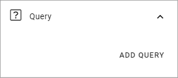

Mega Menu
=====================

This block most likely has it's main use as a part of the Workspace functionality, but can also be added to any page or Page Type, if needed.

You can find more information about the Workspace functionality here: :doc:`Workspace </admin-settings/business-group-settings/workplace/index>`

Settings
***********
These settings are available:

..image:: mega-menu-block-all.png

Query
----------
Here you can set the following:

1. Click ADD QUERY to add pages to the Mega Menu and the Page Picker opens. Use it as is described here: :doc:`The Page Picker </general-assets/page-picker/index>`

If you select a top node, all sub pages to that node are also selected.

2. Set the following:

.. image:: mega-menu-block-query-2.png

+ **Exclude Start Node**: If the start node in what you have selected should not be used, activate this option.
+ **Navigation Depth**: Set the number of levels that should be shown.

When you have added several objects the Mega Manu this way, you can grab the left-most icon and use drag and drop to edit the order.

Display
------------
The following is available here:

.. image:: mega-menu-block-display.png

+ **ADD STYLE**: Click here for some style settings. See below for more information.

+ **Max Width of Column**: Set the maximum width of columns in the Mega Menu here.
+ **Enable dropdown menu**: If you disable this, all menu options, wihin the navigation depth you have decided, will always be shown.
+ **Static Display Level**: Defines the number of levels in the navigation term set that will always be displayed in the menu.
+ **Dynamic Display Level**: Defines the number of levels in the navigation term set that should be displayed in the mega menu when a user clicks an item in the static menu.
+ **Max Height**: As Default, the menu's Height is dynamic, meaning it adapts to the Height needed. You can set a fixed Height in pixels if you wish.
+ **Max Width**: As Default, the menu's Width is dynamic, meaning it adapts to the Width needed. You can set a fixed Wodth in pixels if you wish.
+ **Background Color**: As Default, the Background Color for the Mega Menu is the same as the Header, but you can set another Background Color if you wish.
+ **Text Color**: As Default, the Text Color for the Mega Menu is the same as the text in the Header, but you can set another Text Color if you wish.
+ **Selected Border Color**: Ypou can set Border Color separately if you wish. Default=no Color.

These Style settings becomes available when you click ADD STYLE:

.. image:: mega-menu-block-display-style.png

+ **Font Size**: Use the slider to set the font size in the Mega Menu.
+ **Font Weight**: Use this slider to set how "bold" th font should look.
+ **Uppercase**: If only uppercase should be used for the font, select this option.
+ **Padding**: Set som padding within the block, if needed.

Layout and Write
*********************
The WRITE tab is not used here. The LAYOUT tab contains general settings, see: :doc:`General Block Settings </blocks/general-block-settings/index>`
