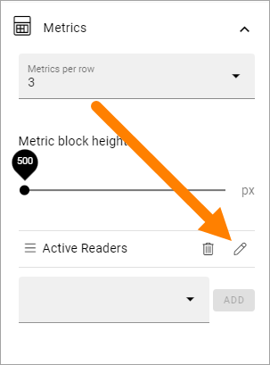

The Metrics block in Omnia 6.12
===================================

**This page is being edited. Will be finished soon.**

This block has it's main use for setting up the Dashboard, but it can also be used on a page to display data about either Teamwork, Search Statistics, Pages or User Activity.

On this page, the options in Omnia 6.12 and later are described.

You can find more information about the Dashoboard here: :doc:`Dashboard </admin-settings/tenant-settings/dashboard/index>`

The following settings are available when you eneter the option:

.. image:: metrics-block-settings.png

And these two options are available at the bottom when you have entered a Scope for the block:

.. image:: metrics-block-settings-more.png

General
********
Here you can add a title for the block and set some padding:

.. image:: metrics-block-settings-general.png

Scope
******
Here you decide what to display in the block:

.. image:: metrics-block-settings-scope.png

+ **Teamwork**: Select what kind of Teamwork, based on template, that will be shown. If you leave Teamwork Template field empty, all teamworks will be shown. 
+ **Search Statistics**: You can display search statistics either for the whole tenant or for the actual business profile.
+ **Pages**: You can select one publishing app to show metrics for. If you don't, metrics for all Publishing Apps will be shown. You can also select a specific page type or a combination of both.
+ **User Activity**: Has no further settings here. 

Further settings that affects what is displayed are found under "Metrics".

Metrics
*********
The following settings are available here:

.. image:: metrics-block-settings-metrics.png

+ **Metrics per row**: Set the number of metrics to be shown per row.
+ **Metric block height**: Use the slider to set the height of the block.

In the field at the bottom you can select which metrics that should be shown, one or several. The options are different depending on the Scope chosen:

+ Teamwork: You can choose to show total number of teamworks, active teamworks, inactive or new teamworks. 
+ Search Statistics: You can select search statistics for the total number of queries, abandoned queries or no result queries.
+ Pages: Here's a lot of options available - Published, Waiting For Approval, Draft, No Comments, Average Number Of Comments, Average ratings, Reach and Underused Content. "No Comments" lists the number of pages that has no comment at all. "Average Number Of Comments" is calculated this way: Total number of comments on all pages dived by the total number of pages. So if there are a total of 100 comments on all pages and there are 200 pages, the average number of comments would be 0,5.
+ User Activity: You can select to show the number of active readers or the number of active contributors.

What is to be considered Underused Content can be set in Omnia Admin, see: :doc:`Metrics Settings </admin-settings/tenant-settings/settings/metrics/index>`

Metrics config
-----------------
For a selected metric you can use some config settings. Click the pen for the settings:

You can use these settings:

.. image:: metrics-config-settings.png

Don't forget to save when you're done.

Filter UI
************
You can also add filters so users can decide what they will see, within the scope and metrics you have decided.

.. image:: metrics-block-settings-filter.png

+ **Max filters per row**: Set the number of filters per row here.

In the field at the bottom you can choose what filters to display. Available options differ depending on scope chosen.

