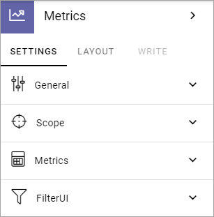
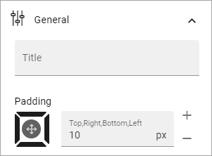
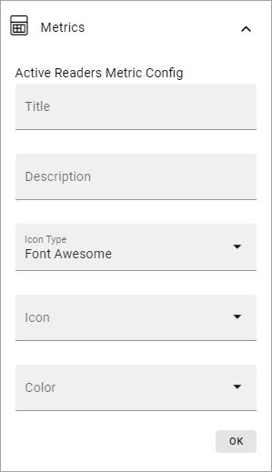
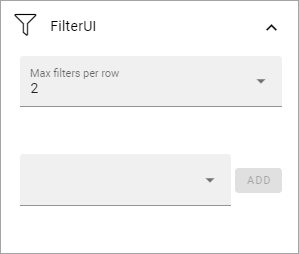

Metrics
===================================

This block can be used on any Omnia page to display data about either teamwork, search statistics, pages or user activity. It is also used when setting up the dashboard in Omnia admin. 

In Omnia 7.5, the block can also be used to list broken links and failed access attempts, see below.

The following settings are available when you enter the option:

.. image:: metrics-block-settings.png

And these two options are available at the bottom when you have entered a scope for the block:

General
********
Here you can add a title for the block and set some padding:

Scope
******
Here you decide what to display in the block:

.. image:: metrics-block-settings-scope.png

+ **Teamwork**: Select what kind of teamwork, based on template, that will be shown. If you leave the "Teamwork template" field empty, all teamworks will be shown. 
+ **Search statistics**: You can display search statistics either for the whole tenant or for the actual business profile.
+ **Pages**: You can select one publishing app to show metrics for. If you don't, metrics for all publishing apps will be shown. You can also select a specific page type or a combination of both.
+ **User activity**: Has no further settings here. 
+ **URL status**: Use this scope for metrics on the system pages 404 not found (for broken links) and 401 unauthoroized (for failed sccess attempts). Available in Omnia 7.5 and later.

Further settings that affects what is displayed are found under "Metrics".

Metrics
*********
The following settings are available here:

.. image:: metrics-block-settings-metrics.png

+ **Metrics per row**: Set the number of metrics to be shown per row.
+ **Metric block height**: Use the slider to set the height of the block.

In the field at the bottom you can select which metrics that should be shown, one or several. The options are different depending on the Scope chosen:

+ Teamwork: You can choose to show total number of teamworks, active teamworks, inactive or new teamworks. 
+ Search statistics: You can select search statistics for the total number of queries, abandoned queries or no result queries.
+ Pages: Here's a lot of options available - Published, Waiting for approval, Draft, No comments, Average number of comments, Average ratings, Reach and Underused content. "No comments" lists the number of pages that has no comment at all. "Average number of comments" is calculated this way: Total number of comments on all pages dived by the total number of pages. So if there are a total of 100 comments on all pages and there are 200 pages, the average number of comments would be 0,5.
+ User activity: You can select to show the number of active readers or the number of active contributors.
+ URL status: By selecting "404 not found" you can list all broken links. By selecting "401 unauthoroized" you can list all attempts to visit a URL the user didn't have access to.

What is to be considered underused content can be set in Omnia admin, see: :doc:`Metrics settings </admin-settings/tenant-settings/settings/metrics/index>`

Metrics config
-----------------
For a selected metric you can use some config settings (can differ depending on the matric), for example:

Should be self-explanatory. Don't forget to save when you're done.

Filter UI
************
You can also add filters so users can decide what they will see, within the scope and metrics you have decided.

+ **Max filters per row**: Set the number of filters per row here.

In the field at the bottom you can choose what filters to display. Available options differ depending on scope chosen.

