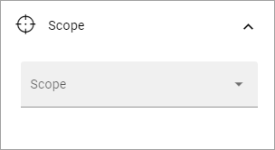
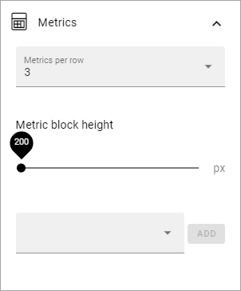

Metrics block
================

This block is used when setting upp the Dashboard in Omnia A dmin, and can be used on any Omnia page to display data about either Teamwork, Pages or Activity.

On this page, the options in Omnia 6.11 and earlier are described. See this page for the options in Omnia 6.12 and later: :doc:`´The Metrics block in Omnia 6.12 </blocks/metrics-block-612/index>`

The following settings are available when you eneter the option:

.. image:: metrics-block-settings.png

General
********
Here you can add a title for the block and set some padding:

.. image:: metrics-block-settings-general.png

Scope
******
Here you decide what to display in the block:

You can select Teamwork, Pages or User Activity. Then some settings becomes available, depending on what you have selected.

+ **Teamwork Template**: Select what kind of Teamwork, based on template, that will be shown. If you leave this field empty, all teamworks will be shown. Available for Teamwork only.
+ **Publishing Apps**: You can select one publishing app to show metrics for. If you don't, all Publishing Apps will be shown. Available for Pages only.
+ **Page Types**: You can select one page type to show metrics for. If you don't, all page types will be shown. Available for Pages only.

For the scope "User Activity" no further options are shown here. You set Metrics, see below.

Metrics
*********
The following settings are available here:

+ **Metrics per row**: Set the number of metrics to be shown per row.
+ **Metric block height**: Use the slider to set the height of the block.

In the field at the bottom you can select just some of the metrics to be shown. The options are different depending on the Scope chosen:

+ Teamwork: You can choose to show only active teamworks or only new teamworks, or both. 
+ Pages: Here's a lot of options available - Published, Waiting For Approval, Draft, No Comments, Average Number Of Comments, Average ratings, Reach and Underused Content. "No Comments" lists the number of pages that has no comment at all. "Average Number Of Comments" is calculated this way: Total number of comments on all pages dived by the total number of pages. So if there are a total of 100 comments on all pages and there are 200 pages, the average number of comments would be 0,5.
+ User Activity: You can select to show the number of active readers or the number of active contributors.

What is to be considered Underused Content can be set in Omnia Admin, see: :doc:`Metrics Settings </admin-settings/tenant-settings/settings/metrics/index>`

To show several metrics on a page (for example in the Dashboard) just add the block several times, with different settings.

Filter UI
************
You can also add filters so users can decide what they will see, within the scope and metrics you have decided.

.. image:: metrics-block-settings-filter.png

+ **Max filters per row**: Set the number of filters per row here.

In the field at the bottom you can choose what filters to display. Available options differ depending on scope chosen.
