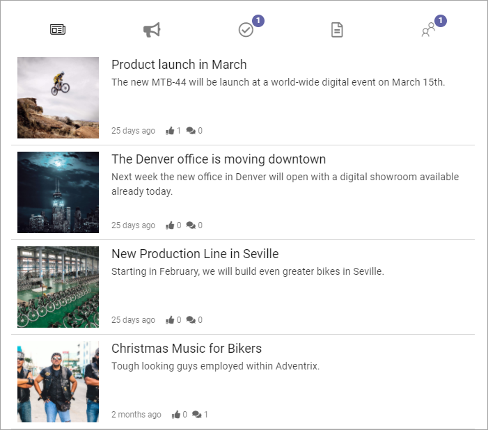
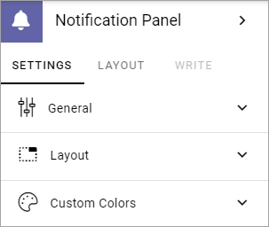
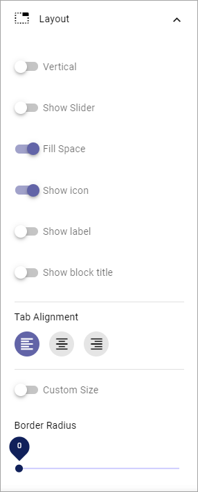
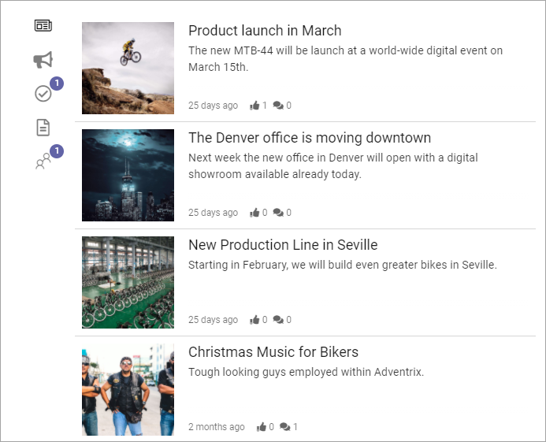
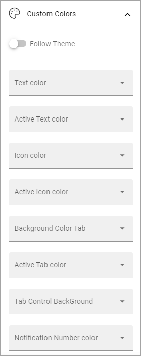

Notification panel
===========================================

Several notification panels can be created in Omnia admin, for various notification purposes. See this page for more information: :doc:`Notification panel settings </admin-settings/business-group-settings/notification-panel/index>`

Here's an example of a Notification panel block as seen by users:

The notification block can be displayed in the action menu or as a block on any page, which is described here. Wether the notification panel should be displayed in the action menu is set up in Omnia admin, in Business profile/Settings/Header/Action menu. See this page for more information: :doc:`Header settings for the business profile </admin-settings/business-group-settings/settings/header/index>`

What you can set in this block is to choose which notification panel to display, and set some layout and color settings for the block. All settings for the content of different notification panels are done in Omnia admin, see link at the top.

Settings
**********
The following settings are available for the block:

Using the tab "Settings" you can set the following:

General
------------
Here you decide which notification panel to display:

.. image:: block-notifications-settings-general-new.png

Layout
-------
You can also set some layout options for this notification panel as displayed in this block.

+ **Vertical**: Select this to show the categories vertically instead of horisontally. See below for an example.
+ **Show slider**: This adds a thin line under or to the left of the active catergory (tab), depending on settings.  
+ **Fill space**: Select this option to let the icons and/or labels fill the whole available space. This has no effect if the space is narrow.
+ **Show icon**: Select this option to display icons for the categories.
+ **Show label**: Select this option to display labels for the categories.
+ **Show block title**: If the block title should be shown, select this option.
+ **Tab alignment**: Use these settings to align the tab icons/text in the available space.
+ **Icon alignment**: If you have selected both Show Icons and Show Text you can use these settings to align the icons relative to the labels. If you have selected only "Show icon" or only "Show label", this option is not shown.
+ **Custom size**: Use this to set a minimum height and/or width for the navigation area in the block (does not affect the content area).
+ **Border Radius**: Use the slider to set the border radius.

Heres an example with the categories shown vertically, with icons (no labels):

Custom colors
---------------
Here's you can decide to follow the theme or not. If you would like to set some custom colors for this particular block, here's what's available:

and these:

.. image:: block-notifications-settings-custom-colors-2-new.png

Layout and Write
*********************
The WRITE Tab is not used here. The LAYOUT tab contains general settings, see: :doc:`General Block Settings </blocks/general-block-settings/index>`

