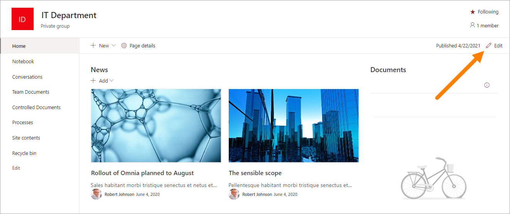
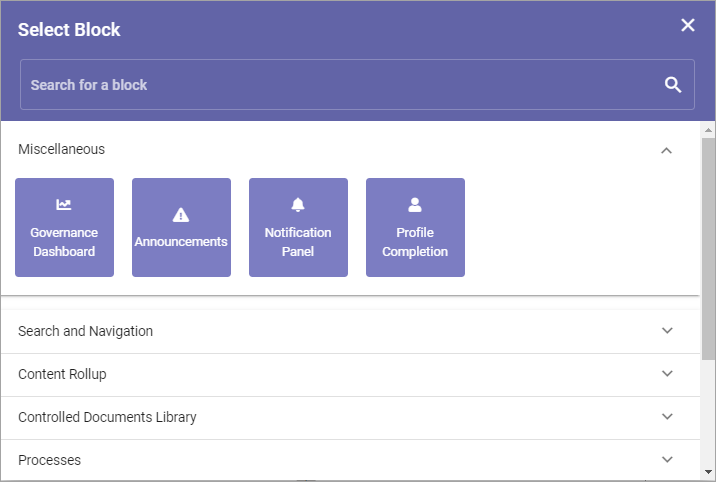

Using the Omnia block web part
================================

Some of the blocks in Omnia can be used in any teamsite, including community sites. To add a block there, you use the Omnia block web part.

This is how:

1. Go to the team site.
2. Go to the page in the team site.
3. Edit the page.

4. Click on the web part that should be above the block. 
5. Click the plus.

.. image:: webpart-edit-clickplus.png

6. Select the Omnia block web part.

.. image:: webpart-omniablock.png

7. Select block.

8. Click the pen to edit settings for the block.

.. image:: webpart-select-block-edit.png

The settings are shown, for example:

.. image:: webpart-select-block-edit-settings.png

You use the settings for the block exactly the same way as when the block is placed on an Omnia page. See the description for the block here: :doc:`Blocks </blocks/index>`

**Note!** In an environment that has been upgraded from an earlier version of Omnia, an older web part can still be available, just called Omnia. You should not use that web part any more.

.. image:: webpart-block-dontuse.png

