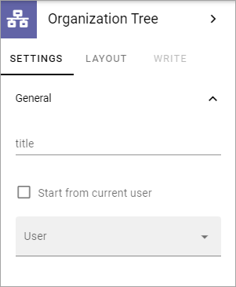

Organization Tree Block
===========================

You can use it to show an organization tree based on information in Azure AD about who reports to who.

You use the following settings:

+ **Title**: You can add a title for the block here.
+ **Start from current user**: If the block always should display the organization based on the logged in user, select this option. 
+ **User**: Another option is to select one user to base the organization tree on. All colleeagues are available in this list.

Here's an example with an organization tree based on John Faulkner. He reports to the CEO and five colleagues report to him.

.. image:: organization-tree-example.png

If there are users registered in your system that should not appear in the organization tree, they can be excluded. See the description of "Exclude filters" at the bottom of this page: :doc:`User Profile Card settings </admin-settings/tenant-settings/system/user-profile-card/index>`
