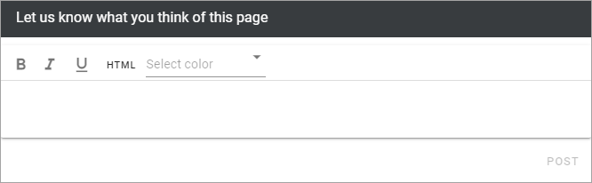

Page feedback
=====================

This block makes it possible for users to send feedback about the page to the owner of the page. 

The user just types the message in the field and clicks "Post".

.. image:: page-feedback-plain-new2x.png

If rich text has been enabled for the block (see below), some formatting options are available, here's an example:

When the post has been sent, something like the following is shown:

.. image:: page-feedback-sent.png

In Write mode a page author will see the feedback, for example:

.. image:: page-feedback-writemode-new.png

The latest feeback posts are shown here. The name of the person who sent the feedback is clickable. The user profile card will open, if it's used within your organization. If it's not, the colleague's delve page will be displayed.

The number in the top right corner indicates the total number of feedback posts. If you click that number, all posts are shown.

.. image:: page-feedback-all-click.png

Settings
**********
The following settings are available:

.. image:: page-feedback-settings-new3.png

+ **Title**: If a Title should be shown for the block, add it here.
+ **Enable rich text**: This label is outdated. What you can do here is to set the text formatting options; Plain text - meaning no formattings options, or to enable the Limited rich text editor or the (full) Rich text editor. 
+ **Padding**: Add some padding if needed.

The options available in the rich text editor and the limited rich text editor are set up in Omnia admin, see: :doc:`RTF editor settings </admin-settings/tenant-settings/settings/rtf-editor/index>`

For more information about how to use either rich text sditor, see: :doc:`Editing text with the RTF editor </general-assets/rtf-editor/index>`

Layout and Write
*********************
The WRITE Tab is not used here. The LAYOUT tab contains general settings, see: :doc:`General block settings </blocks/general-block-settings/index>`

Who the feedback is sent to and how
*************************************
The page feedback is sent to the page owner (Page contact) through Email. The following settings are needed for this to work.

**General note**: For a user to be able to receive Emails, the acccount must be Email enabled.

The page contact property (which can be named something else) must be selected for the page type. Then a setting must be done (click the cog wheel).

.. image:: page-contact-page-type-new3.png

"Receive Email" must be selected for the page contact property settings.

.. image:: page-contact-page-type-property-new2.png

Page feedback button
*********************
If not using this block, page feedback can be made available through an action button. For more information, see the heading "Page feedback" on this page: :doc:`The action button block </blocks/button-link/index>`

