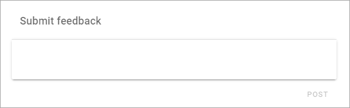
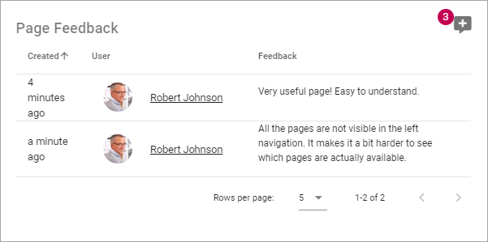
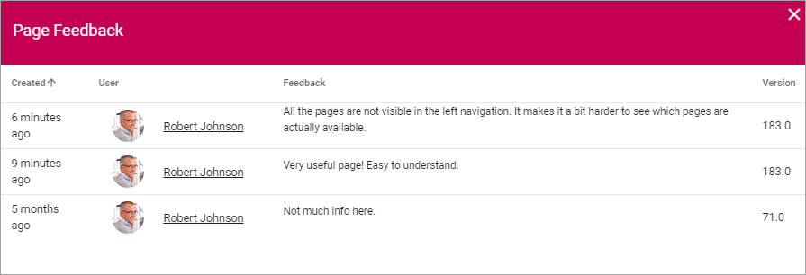
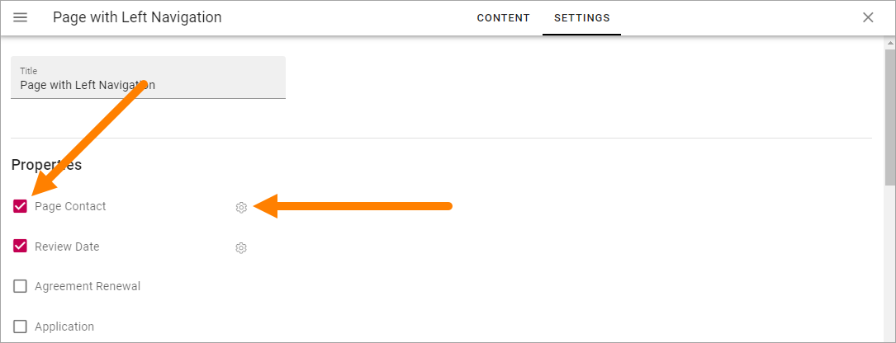
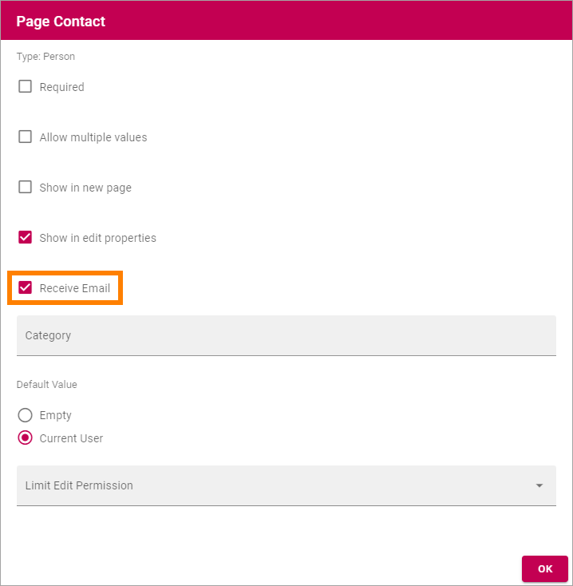

Page Feedback
=====================

This block makes it possible for users to send feedback about the page to the owner of the page. Here's an example:

The user just types the message in the field and clicks "Post".

If Rich Text has been enabled, some formatting options are available, here's an example:

.. image:: page-feedback-rich-new.png

When the post has been sent, something like the following is shown:

.. image:: page-feedback-sent.png

In Write mode a page author will the see the feedback, for example:

The latest feeback posts are shown here. The name of the person who sent the feedback is clickable and opens that persons Delve page, where you can, for example, find contact information.

The number in the top right corner indicates the total number of feedback posts. If you click that number, all posts are shown, for example:

Settings
**********
The following settings are available:

.. image:: page-feedback-settings-new.png

+ **Title**: If a Title should be shown for the block, add it here.
+ **Enable rich text**: To enable rich text, select this options. Some formatting options will then be available for the user when typing a feedback message, see above.
+ **Padding**: Add some padding if needed.

Layout and Advanced
---------------------
The tabs Layout and Advanced contain general settings, see: :doc:`General Block Settings </blocks/general-block-settings/index>`

Who the feedback is sent to and how
*************************************
The Page Feedback is sent to the Page Owner (Page Contact) through e-mail. The following settings are needed for this to work.

The Page Contact property (which can be named something else) must be activated for the Page Type. Then a setting must be done (click the cog wheel).

"Receive e-mail" must be selected for the Page Contact property settings.

