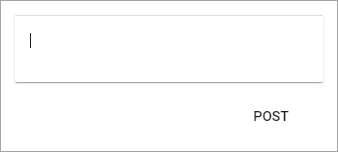
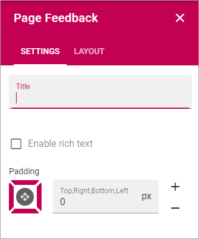

Page Feedback
=====================

This block makes it possible for users to send feedback about the page to the owner of the page. Here's an example:

The user just types the message in the field and clicks "Post".

If Rich Text has been enabled, some formatting options are available, here's an example:

.. image:: page-feedback-rich.png

Settings
**********
The following settings are available:

+ **Title**: If a Title should be shown for the block, add it here.
+ **Enable rich text**: To enable rich text, select this options. Some formatting options will then be available for the user when typing a feedback message, see above.
+ **Padding**: Add some padding if needed.

Who the feedback is sent to and how
*************************************
(Information will be added soon.)

