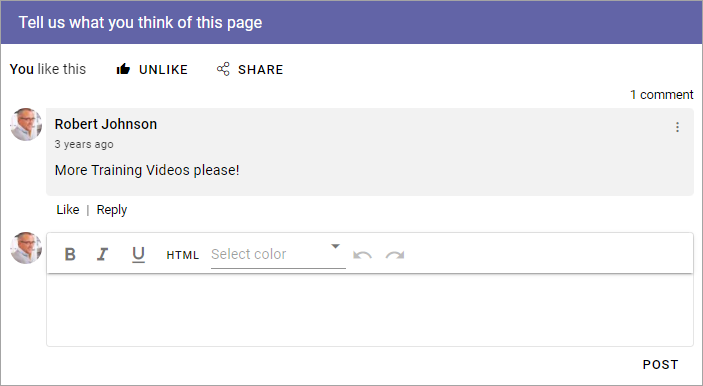
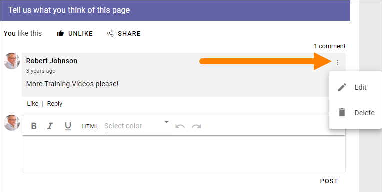
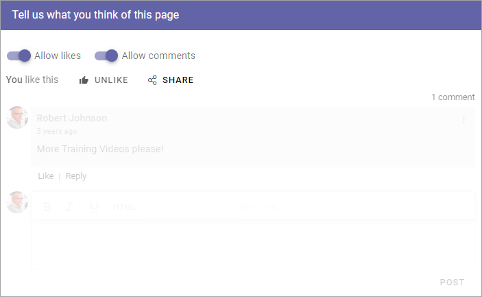
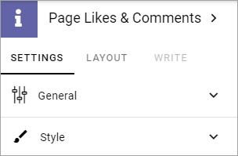
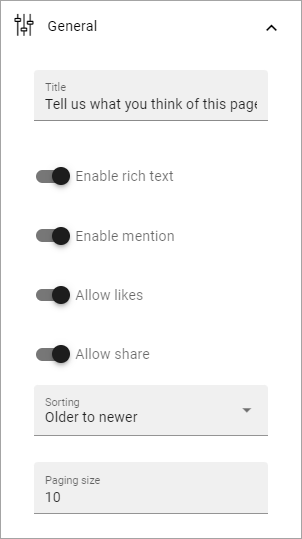
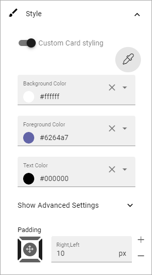

Page Likes and Comments
===========================================

The block makes it possible for the end user to like and comment a specific web page, including news and community pages (knowledge articles and discussions). It is also possible to reply to comments and it can be possible to use mentions. Besides that, users can share the page with others by e-mail.

It is possible for the end user to edit and delete a comment, made by the user, by using the menu. 

When a comment is deleted it works this way: If there are no answers to the comment it will just be removed. If there are answers, the  comment will be replaced with a text that states that it has been deleted and by whom. Everyone can delete their own comments. A Site Collection administrator can delete any comment. 

Turning the options on or off
-------------------------------
When the block is added to a page (or to the Page Type), authors can turn on or off likes and/or comments using Write mode.

This can be very handy if Page Likes and Comments is present in a Page Type, but should not be used on every page.

Settings for the block
************************
The following settings are available for the block:

General
----------
The following settings are available on this tab:

+ **Title**: If a title should be shown for the block, add it in this field. If variations exists for the page, it looks like in the image above. Titles in other languages are set in the variations. If there is  no variations you can set the title in any or all the languages active in the tenant. 
+ **Enable Rich Text**: If you enable Rich Text, some basic formatting will be availble for users.          
+ **Enable mention**: If it should be possible to use mentions in comments on this page or in this page type, select this option. See below for an example.
+ **Allow Likes**: If it should be able to like a comment, select this option.
+ **Allow Share**: If it should be possible to share a comment, select this option - meaning the possibility to send a comment to another user by e-mail.
+ **Sorting**: Here you choose how to sort the comments; older first or newer first.
+ **Paging size**: Add a number (1-99) to set the number of items (comments) that should be displayed on each “page” of the list.

Here's an example of a mention:

.. image:: comment-mention-new2.png

Style
----------
These settings are available onf the Style tab:

.. image:: likes-65-style.png

You can add some padding if needed and it's also possible to set styling for the "cards" (meaning each comment with sub comments). By selecting "Custom Card styling" you can set the following:

For Advanced settings, the following is available:

.. image:: likes-65-style-card-advanced.png

Layout and Write
*********************
The WRITE tab is not used here. The LAYOUT tab contains general settings, see: :doc:`General Block Settings </blocks/general-block-settings/index>`

More on Likes and Comments
***************************
Users can like comments as well as pages.

If a number of users likes a page, that information can be clicked to display a list of the users that has liked the page or comment.

**Note!** Likes on comments does not affect trending in any way.

Several options, for example to add an image, can be available in the Limited RTF Editor, depending on how it is set up. See this page for more information: :doc:`RTF Editor settings </admin-settings/tenant-settings/settings/rtf-editor/index>`

