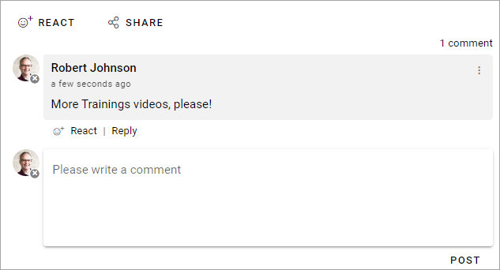
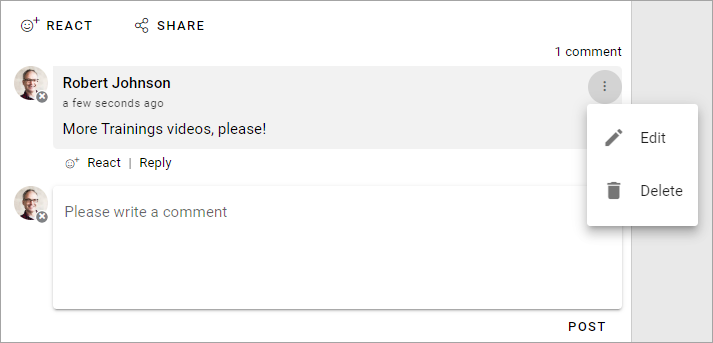
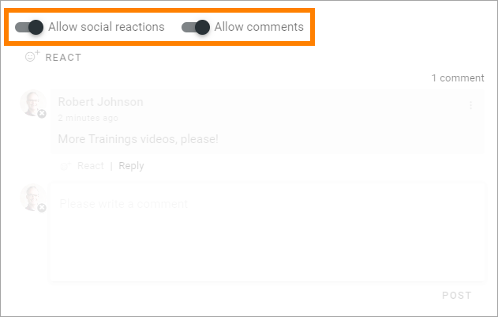
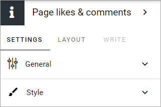
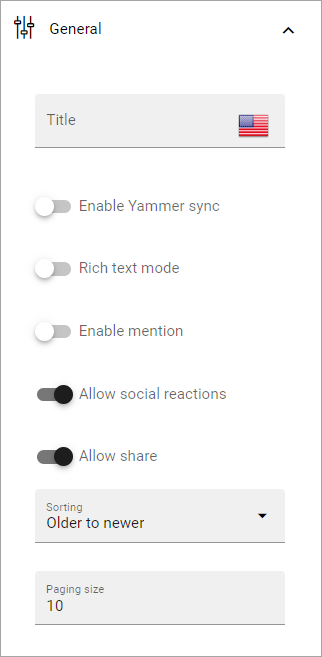
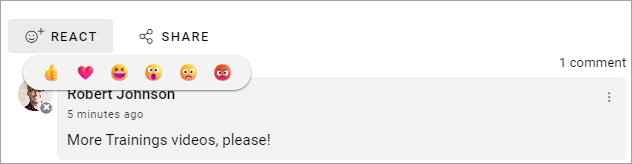
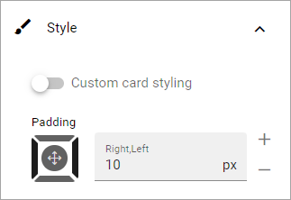
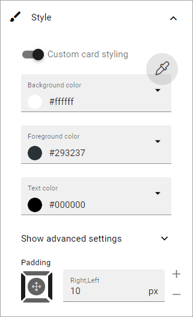
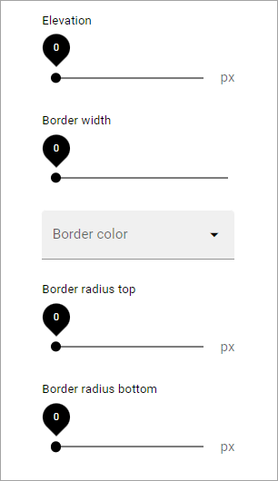

Page likes and comments
===========================================

The block makes it possible for the end user to like and comment (or add a social reaction if that is allowed) a specific web page, including news and community pages (knowledge articles and discussions). It is also possible to reply to comments and it can be possible to use mentions. Besides that, users can share the page with others by Email.

It is possible for the end user to edit and delete a comment, made by the user, by using the menu. 

When a comment is deleted it works this way: If there are no answers to the comment it will just be removed. If there are answers, the  comment will be replaced with a text that states that it has been deleted and by whom. Everyone can delete their own comments. A publishing app administrator can delete any comment. 

Turning the options on or off
-------------------------------
When the block is added to a page (or to the page type), authors can turn on or off likes and/or comments using Write mode.

This can be very handy if the block "Page likes and comments" is present in a page type, but should not be used on every page.

(Note that social reactions is allowed here. If social reactions is not allowed, the option is be "Allow likes" instead of "Allow social reactions".)

Settings for the block
************************
The following settings are available for the block:

General
----------
The following settings are available on this tab (image from Omnia 7.5):

+ **Title**: If a title should be shown for the block, add it in this field. Click the flag to change language. 
+ **Enable Yammer sync**: If Yammer sync is enabled for the page collection, this option is available. See more information below about how to use it.
+ **Rich text mode**: If you enable rich Text, some basic formatting will be availble for users.          
+ **Enable mention**: If it should be possible to use mentions in comments on this page or in this page type, select this option. See below for an example.
+ **Allow social reactions**: Can be available if settings allow it. If it should be possible to to use social reactions in this block, select this option. The same social reactions functionality as in Teams can be used. The tenant feature "Social reactions" must be activated for this option to be available.
+ **Allow likes**: If it should be able to like a comment, select this option. If the tenant feature "Social reactions" is activated, the "Allow social reactions" option replaces this option. Then social reactions is used instead of likes.
+ **Allow share**: If it should be possible to share a comment, select this option - meaning the possibility to send a comment to another user by email.
+ **Sorting**: Here you choose how to sort the comments; older first or newer first.
+ **Paging size**: Add a number (1-99) to set the number of items (comments) that should be displayed on each “page” of the list.

If "Allow social reactions" is activated, these social reactions can be used when commenting:

More about Yammer integration
---------------------------------
If Yammer integration is set up on page collection level, you can choose to activate a two way integration of comments here by selecting "Enable Yammer sync". When this option is on, a comment added in Yammer is also shown in Omnia.

**Important note!** Due to limitations in the Yammer API, a comment on a comment is not placed as expected (but a comment on a post is). The comment on a comment is shown in Omnia, but is not indented, as you would expect it to be. This is a limitation in the Yammer API, not in Omnia.

For more information about setting up Yammer integration on page collection level, see: :doc:`Page collection settingss </pages/page-collections/page-collection-settings/index>`

More information about setting up Yammer in Omnia is found here: :doc:`Setup Yammer in Omnia </setup/setup-yammer-in-omnia/index>`

Style
----------
These settings are available onf the Style tab:

You can add some padding if needed and it's also possible to set styling for the "cards" (meaning each comment with sub comments). By selecting "Custom Card styling" you can set the following:

You use the pipette to select a theme. The rest of the options should be self-explanatory.

For advanced settings, the following is available:

Should eb self-explanatory.

Layout and Write
*********************
The WRITE tab is not used here. The LAYOUT tab contains general settings, see: :doc:`General block settings </blocks/general-block-settings/index>`

More on likes and comments
***************************
Users can like comments as well as pages.

If a number of users likes a page or comment, the information stating that can be clicked to display the list of users liking the page or comment.

**Note!** Likes on comments does not affect trending in any way.

Several options, for example to add an image, can be available in the limited RTF editor, depending on how it is set up. See this page for more information: :doc:`RTF editor settings </admin-settings/tenant-settings/settings/rtf-editor/index>`

