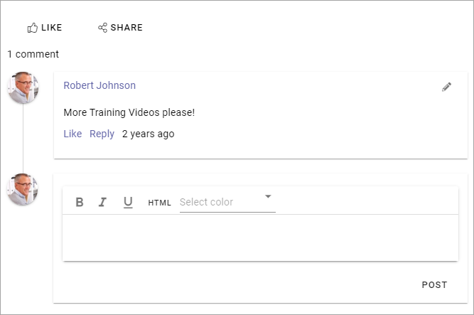
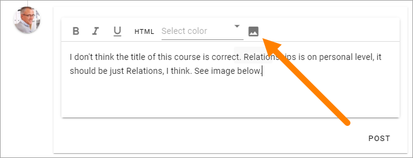
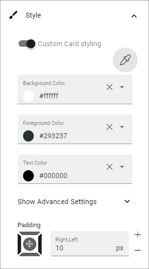
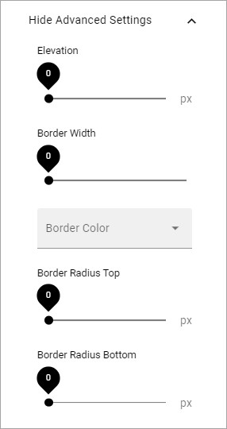

Page Likes and Comments
===========================================

The block makes it possible for the end user to like and comment a specific web page, including news and community pages (knowledge articles and discussions). It is also possible to reply to comments and it can be possible to use mentions. Besides that, users can share the page with others by e-mail.

It is possible for the end user to edit and delete a comment, made by the user, by clicking the pen icon. 

.. image:: comments-and-likes-pen-new.png

When a comment is deleted it works this way: If there are no answers to the comment it will just be removed. If there are answers, the  comment will be replaced with a text that states that it has been deleted and by whom. Everyone can delete their own comments. A Site Collection administrator can delete any comment. 

In Omnia 6.5 this block has improved. Find more information at the bottom of the page.

Turning the options on or off
-------------------------------
When the block is added to a page (or to the Page Type), authors can turn on or off likes and/or comments using Write mode.

.. image:: page-likes-author-new.png

This can be very handy if Page Likes and Comments is present in a Page Type, but should not be used on every page.

Settings for the block
************************
The following settings are available for the block:

.. image:: comments-and-likes-settings-new4.png

+ **Title**: If a title should be shown for the block, add it in this field. If variations exists for the page, it looks like in the image above. Titles in other languages are set in the variations. If there is  no variations you can set the title in any or all the languages active in the tenant. 
+ **Enable Rich Text**: If you enable Rich Text, some basic formatting will be availble for users.          
+ **Enable mention**: If it should be possible to use mentions in comments on this page or in this page type, select this option. Here's an example of a mention:

.. image:: comment-mention-new.png

Layout and Write
*********************
The WRITE tab is not used here. The LAYOUT tab contains general settings, see: :doc:`General Block Settings </blocks/general-block-settings/index>`

More on Likes and Comments
***************************
Users can like comments as well as pages.

A user can click the hand to see a list of the users that has liked the page or comment.

**Note!** Likes on comments does not affect trending in any way.

Images can be added to comments, if the Limited RTF Editor is set up that way. This icon is then available, so the user can start the Media Picker and select an image:

For this icon to be available it must be added to the Limited RTF Editor in Omnia Admin settings. See this page for more information: :doc:`RTF Editor settings </admin-settings/tenant-settings/settings/rtf-editor/index>`

Page Likes and Comments block in Omnia 6.5
*******************************************
In Omnia 6.5 this block will have some new options.

Settings in 6.5
-----------------
The General tab will have the following options in Omnia 6.5:

.. image:: likes-65-general.png

Here's descriptions of the new options:

+ **Allow Likes**: If it should be able to like a comment, select this option.
+ **Allow Share**: If it should be possible to share a comment, select this option - meaning the possibility to send a comment to another user by e-mail.
+ **Sorting**: Here you choose how to sort the comments; older first or newer first.
+ **Paging size**: Add a number (1-99) to set the number of items (comments) that should be displayed on each “page” of the list.

There will also be a Style tab available in Omnia 6.5:

.. image:: likes-65-style.png

The padding settings have been moved here and it's also possible to set styling for the "cards" (meaning each comment with sub comments). By selecting "Custom Card styling" you can set the following:

For Advanced settings, the following is available:

All other settings that is described above also apply for Omnia 6.5.

