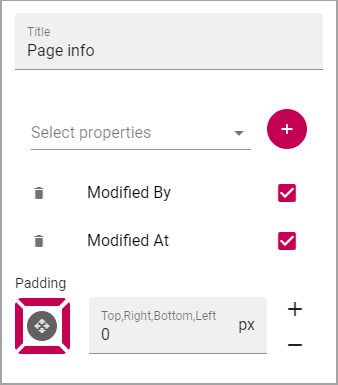

Page Properties
===========================================

Use this block to show information about the page, for example when it was last edited and by whom. Here's an example:

.. image:: page-properties-info.png

The following settings are available for the block:

.. image:: page-properties-settings.png

+ **Title**: You can add a title for the block here.
+ **Select Properties**: Use the list the select properties for the information you want to display. Click the plus to add the property, and make sure it's selected.
+ **Padding** You can add some padding around the content of the block, if needed.

Here's an example with the properties for the image above selected:

If a selected property should not be shown, just deselect it. You can delete a property from the list by clicking the dust bin.

Layout and Advanced
**********************
The tabs Layout and Advanced contain general settings, see: :doc:`General Block Settings </blocks/general-block-settings/index>`
