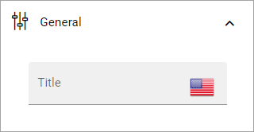
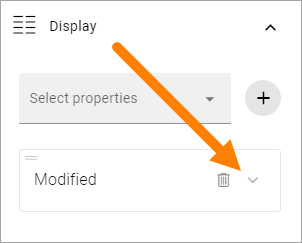
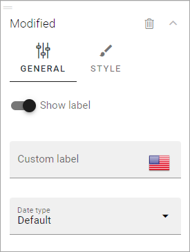
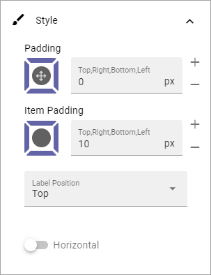

Page properties
===========================================

Use this block to show information about the page, for example when it was last edited and by whom. Here's an example:

.. image:: page-properties-info-new2.png

In Omnia 7.6.7 and later -  if the block does not contain any values, it's not shown.

Settings
***********
The following settings are available for the block:

.. image:: page-properties-settings-new3.png

General
------------
Here you acn add a title for the block, if needed.

+ **Title**: If a title should be shown for the block, add it in this field. You can set the title in the languages active in the tenant. 

Display
---------
Here you select the properties to display.

.. image:: page-properties-block-display.png

+ **Select properties**: Use the list the select properties for the information you want to display. Click the plus to add the property.

For each property you add, you can set some style options. Click here to set them:

For General Style you can set:

+ **Show label**: Decide to show the block label or not. 
+ **Custom label**: Add a custom label here if needed.
+ **Date type**: For date type you can choose Default, Classic or Social. Not available for all properties.

For extra style, some color settings and icon settings are available:

.. image:: page-properties-block-display-style-style.png

Style
---------
Use the Style tab for these settings:

+ **Padding** You can add some padding around the content of the block, or for each item, if needed.
+ **Label position**: You can set the label position at the top or to the left.
+ **Horizontal**: If you want the properties to be shown side by side instead, which may make sense if you add the block to a broader part of the page, select this option.
+ **Hide separator**: When you select "Horizontal", you can choose to use a separator line.

Here's an example with the information shown horizontally, with a separator:

.. image:: page-properties-block-style-horizontal.png

Layout and Write
*********************
The WRITE Tab is not used here. The LAYOUT tab contains general settings, see: :doc:`General block settings </blocks/general-block-settings/index>`
