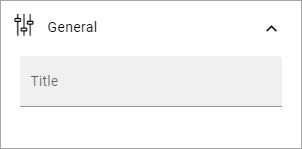
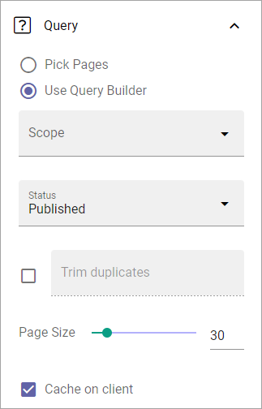
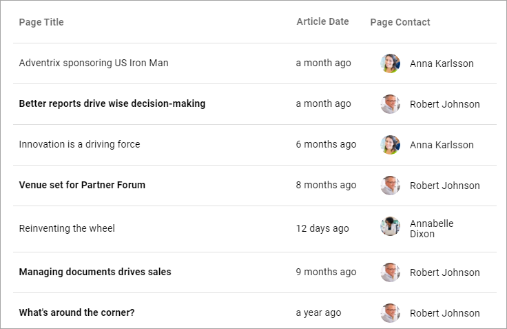
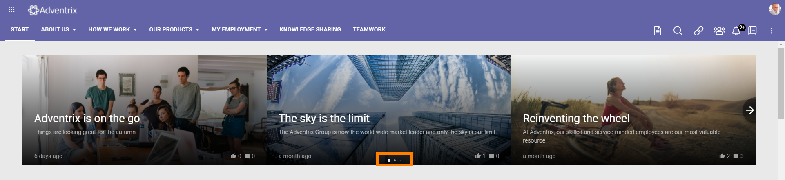
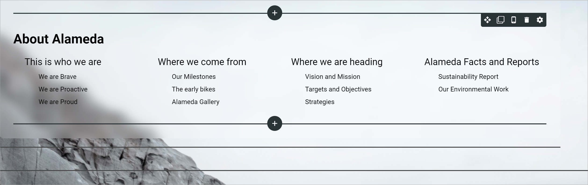
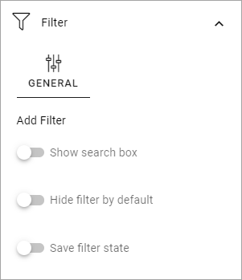

Page rollup
===========================================

This block can be used for many purposes, for example:

+ List news in different ways; a news center, new news, latest news etc.
+ Most read pages.
+ Most commented pages.
+ Popular pages.
+ Underused pages.
+ Pages with a certain variation (for example a language).
+ Created but unpublished pages.
+ Various page statistics.
+ Various rollups that authors and editors can benefit from.
+ Part of a news letter implementation.
+ Part of an event management implementation.

For implementation examples, see this page: :doc:`Page rollup implementation examples </blocks/page-rollup/page-rollup-implementation/index>`

Settings
*********
These settings are available for the block:

.. image:: page-rollup-settings-612.png

General
--------
Here you can add a title for block:

If any variations exist, titles in other languages are handled through variations. If no variations exist you can add titles in any or all languages in the tenant.

Query
------
Here you can set the following:

+ **Pick pages**: If the editor should be able to pick pages from a list, select this option.
+ **Pick in Write mode**: Available when "Pick pages" is selected. Select this option if editors should be able to pick pages in Write mode. If not selected, Design mode has to be used.
+ **ADD PAGE**: When you have selected "Pick pages", you can pick some pages to always be shown. Click this option and use the page picker. See this page for more information: :doc:`Page picker </general-assets/page-picker/index>`
+ **Use query builder**: If you want to use the query builder to set which pages should be available here, select this option.

For query builder, the following options are available:

+ **Scope**: When you have chosen to use the query builder, select scope for the block. This is where you choose where to get the pages from. You can select:

  + Tenant.
  + Business profiles.
  + Apps.
  + Page collections.
  + Navigation path.
  + Channels.

When you have selected apps, business profiles, channels or page collections, as the next step, you select one or more to get the pages from. 

The following settings can then be available, depending on scope chosen:

+ **ADD FILTER**: Available for scope Tenant. Use it to add filters, to further decide what should be shown in the rollup.  
+ **Cache on client**: This setting can be used to speed up rendering on subsequent page loads. This is is done by storing data in the browser cache. Default: selected.
+ **Current user subscription**: Available for scope Channels. Select this if only the pages that the logged in users subscribes to should be displayed.
+ **Current node/Custom**: Available for scope Navigation path. Choose the start point for the navigation path to be displayed. If you select "Custom", you can use the page picker to select start node.
+ **Custom**: Available for scope Navigation path. Use to select start node.
+ **Exclude current page**: Available when you have chosen scope for the query builder. The default setting is to exclude the current page, but if you, for some reason, would like to include the current page, uncheck this option.
+ **Exclude start node**: Available for scope Navigation path. If the start page selected should not be displayed in the block, select this option.
+ **Exclude variations**: Usings this option, you can exclude varations from the query. Not available for Navigation path.
+ **Filter by user subscription**: Available for scope Channels. Select this if the list should display only thos channels the logged in user follows.
+ **Navigation depth Level**: Available for scope Navigation path. Choose the number of nodes that should be displayed, including the start node.
+ **Page size**: Use the slider, or type the number (1-99) to set the number of items (pages) that should be displayed on each "page" of the list. Also see under *Display* below for additional settings for the list. 
+ **Status**: By using this option you can create rollups for pages with the status Never published, Published or Any status. 
+ **Trim duplicates**: If more than one Page Rollup block is added to a page, this option can be used to handle duplicates between the blocks. When the option is selected, you can enter a number indicating the priority for duplicates, for this block. If you set "1" for a block it means this block has priority showing a post that would have been a duplicate. 

More on scope Navigation path
---------------------------------
Navigation path is a special case, it's used for creating a navigation. When you have selected start node you can choose start node and navigation depth. There's also a view available, specifically for Navigation path; Navigation view. Select it under Display. It's only available if you first select Navigation path as Scope.

**A tip**: When you're creating a page type, selecting "Current node" for a Navigation path can be very useful. Wherever that page type is used, the view (Navigation view) always starts at the current node for that page.

Display
----------
Select View here. Note that a preview is shown in the blocks

.. image:: page-rollup-settings-display-new.png

The following lists all available display settings, shown in different order for different displays, here listed in alphabetical order.  

Options for all views
------------------------
These options are available for most views:

+ **Date**: Select the property that contains the date for the item(s) to display. Available for Roller, Listing with image, Dynamic roller, Card and Newsletter.
+ **Dialog image**: Select image to display, if any. Available when ypu have selected "Open page as a dialog".
+ **Hide block when no data**: Select this option if the block should be hidden when there's nothing to display.
+ **Hide if read**: Select this option to hide all pages the logged in user has visited. This affects all pages, including news.
+ **Highlight non-read**: This option makes sure non-read pages are highlighted. Default=selected. Deselect if you don't want that.
+ **Image**: Select the property that contains the image for the item(s) to display. Available for Roller, Listing with image, Dynamic roller, Card and Newsletter views.
+ **Image Ratio**: Select ratio for the image; Landscape, Square or Wide. Available for Roller, Listing with image, Dynamic Roller and Newsletter.
+ **Link label**: Add the text to be shown for the link here. Available only if "Show link" is selected.
+ **Link URL**: Add the URL to open when a user clicks the link. Available only if "Show link" is selected.
+ **Max display limit**: Available only for scope Navigation path, for all views. Set the number of pages that should be displayed. 
+ **No result text**: Enter the text that will be shown if no page can be displayed.
+ **Open in editor**: Available for all views except Calendar. If this option is selected, a page link can be clicked to open the page in edit mode. This options was devolped with rollups for editors and authors in mind. Permissions apply, so if a user without any edit permissions for the page opens a page this way, nothing can be edited.
+ **Open in new tab**: If the link should be opened in a new tab (as opposed to in current window or dialog), select this option.
+ **Open page as a dialog**: If the page should be opened in a dialog instead for in a page (new or current), select this option. 
+ **Padding**: Add some padding between the list and the block border, if needed.
+ **Paging**: Select paging here; "No paging", "Classic" or "Scroll". Available for List view, Dynamic roller, Card and Newsletter.
+ **Show likes/comments**: If the number of likes and comments should be displayed for the item, select this option. Available for Roller, Listing with image, Dynamic roller and Card.
+ **Show link**: You can add a link button at the bottom of the list. The first page collection is default, but you can link to any target. 
+ **Sort by**: Choose what the list should be sorted by, and then select ascending or descending. Available for all, except Navigation view. Note that in Omnia 6.12 and later the sorting is extended. You can now sort on Comment, Like, Rating, Feedback, Last activity and Last Commented. For the Navigation view you can also sort on Navigation. 
+ **Summary**: Select the property that contains the page summary for the item to display. Available for Listing with image, ListvView, Dynamic roller, Card and Newsletter.

Roller
------
Contains general settings only, see above. 

Listing with image
-------------------
Contains mostly general settings, see above. The only special setting is:

+ **Show rating**: If the rating for the page(s) displayed should be shown, select this option. 

List view
------------
Contains mostly general settings, see above. The only special setting is:

+ **Show Export to Excel**: If it should be possible for users to export a list to Excel, select this option. When this is done, an "Export to Excel" button is shown. 

You also have to add at least one column, for the display to work. See below for more information.

Dynamic roller
-----------------
The special settings for this view are:

+ **Autoplay**: If the roller should roll automatically, select this option. 
+ **Delay between slides**: Set the time between slides in milli seconds.
+ **Loop**: Normally a roller stops when the last post is reached (and can restart after a short while). When this option is selected, there is no "end" and the roller just keeps rolling. Important note: When Loop is selected the arrows users can use to roll "manually" are not shown.
+ **Number of slides to display**: Select number of slides, 1-12.
+ **Show paging**: Small icons shown that users can use to page back and fort. See image below for an example.
+ **Show anvigation**: If navigation icons for the users to use for rolling should be shown, select this option.
+ **Slider size**: Select the size of the slider here: Small, Medium, Large or Extra large. 
+ **Slider type**: Select Horisontal slider or Vertical slider. 

For the general settings, see above.

Card
------
The special settings for this view are:

+ **Preview**: Select the property to base the preview on. It can be either a media property or a document data property.
+ **Cards per row**: As it says, set the number of cards to show per row.
+ **Show last activity**: If you seect this, the last activity for the page, if any, will be displayed on the card.
+ **Person**: This option can be used to show properties in Card view.
+ **Show page type**: If this option is selected, the page type used for the page is shown as metadata, the same way as other properties.
+ **Show rating**: Use it to show the page's rating in the card.
+ **Term properties**: Can be used to show properties in Card view. Click "Add" and select a property. Continue the same way for additional properties.

For general settings, see above.

You can also choose where properties for date, person, tags and reactions (if added) will be placed. Use these settings:

.. image:: place-meta-new.png

Newsletter
-----------
As it suggests, this view is suitable for use in a newsletter set up. The special settings are:

+ **Contact**: Select the property to be displayed as Contact. 
+ **Content**: Select the property that contains the page content for the item to display. 
+ **Page content character limit**: If the number of characters displayed for Page content should be limited, add the number here. The content is simply just cut after that. 
+ **Page summary character limit**: If the number of characters displayed for Page summary should be limited, add the number here. The summary is simply just cut after that. 

For general settings, see above.

Event List
------------
As it suggests, this view is suitable for use in a Event Management set up. Contains general settings only, see above. You also have to add at least one column, for the display to work. See below for more information.

Navigation view
-----------------
As said above, this is a special case, used for navigation. The Navigation view is only available for scope Navigation path. Mostly general settings, see above. the ony special settings is:

+ **Max display limit**: To limit the number of items being displayed, add a fixed number here. 

Calendar
---------
The special settings for this view are:

+ **Start date/End date**: You can select a property for start date and a property for end date.
+ **Default calendar type**: Can be Month, Week or Day.
+ **Enable calendar type dropdown**: Makes it possible for users to select Month, Week or Day.
+ **Default time**: Select a defaul time from the list.
+ **Include time**: Select this to display time for events in the calendar.
+ **Weekdays**: Select what is to be considered as work days in the calendar.
+ **Event color**: Use it to set specific color for events in the calendar.
+ **Event height**: Use the slider to set height for the events in the calendar. See a preview in the block.
+ **Height**: Use the slider the set the height for the whole calendar. See a preview in the block.

For general settings, see above.

Adding columns
----------------
For "List view" and "Event list", you have to add at least one column, for the display to work. Here's an example with three columns added for List view:

.. image:: list-view-columns-new3.png

This could show the following:

Some examples and tips
-------------------------
"a month ago" etc is the "Social" setting for date. If you would like to show exact dates instead, select "Normal".

"Show paging" in settings for "Dynamic roller" makes these icons available for navigation:

Here's a simple example of a Card view used for navigation purposes:

.. image:: card-view-example-pages.png

Card view can now display sub pages if the scope "Navigation path" is used. Here's an example:

.. image:: card-view-example-sub-pages.png

The card view also supports a dynamic number of properties that can be displayed in the card. Here's an example:

.. image:: pagerollup-cardview-terms.png

The Navigation view can be used to display a mega menu style navigation. Here's an example of a page rollup used for this purpose:

Style settings
----------------
For Roller, Dynamic roller and Card, extra style settings are available, for example (Card):

.. image:: page-roller-style.png

Just try out these settings. A preview is shown in the block.

Filter
-------
If users should be able to filter the list and/or search here, use these options. 

The following options are specific for the Page Rollup block:

+ **Save filter state**: If you select this option the filter keeps it's state in the page URL as long as the page is active, and will be activated when the user goes back to the page, by using the browser's Back button. The URL can also be copied and for example be used to prepopulate the page rollup.

The rest of the options are the same as for other blocks. See this page for information on how to use these filter options: :doc:`Filter UI </blocks/general-block-settings/filters/index>`

In Omnia 7.0 and later, new options for filtering can be available, see: :doc:`Filter options for blocks in Omnia v7 </blocks/general-block-settings/filter-options-block/index>`

Time Period
--------------
These settings where called "Social period" in earlier Omnia versions. The following settings are available here:

.. image:: page-rollup-settings-social-new3.png

Use these settings to decide the time period calculated for any of these options. If you don't select anything, it means "No limit". You can select one week, two weeks or one month instead.

Filter on a specific variation
--------------------------------
If just pages with a certain variation (language or other variation) should be listed in the rollup, it can be done this way:

.. image:: page-rollup-variation-example-new.png

Only news in Swedish will be listed in this example.

Metric
*******
Using these settings you can show a metric in the block displaying the number of pages that is valid for the query settings. The metric can then be clicked to display the page rollup you have set uo.

This can for example be used to create a rather compact page or section with different metrics in different blocks, that the user can use to click the desired metric to see the full list.

.. image:: page-rollup-metric.png

+ **Show metric**: Select this to decide to show the metric.
+ **Title**: Add a title for the metric if needed.
+ **Description**: A description for the metric can also be added.
+ **Icon type/Icon**: Select an icon type and an icon, if you want to.
+ **Color**: This sets the color for the divider above the metric. 
+ **Dialog width/height**: Set width and height for the dialog displaying the list of pages.

Layout and Write
**********************
The WRITE tab is not used here. The Layout tab contains general settings, see: :doc:`General block settings </blocks/general-block-settings/index>`

