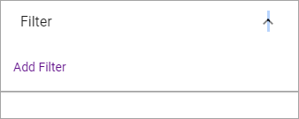

Page Rollup
===========================================

This block can be used for many purposes, for example rollup, Latest News and similar - and for much more, not just for News.

Settings
*********
These settings are available for the block:

.. image:: page-rollup-settings.png

Query
------
Here you can set the following:

.. image:: page-rollup-settings-query.png

+ **Scope**: Select scope for the block; Publishing Apps or Page Collections. Then open the list below and select Publishing Apps/Page Collections.
+ **Exclude current page**: The default settings is to exclude the current page, but if you, for some reason, would like to include the current page, uncheck this option.

Social Period
--------------
Use these settings to decide for how long likes ands comments should be displayed here. The default setting is "No limit" but you can select one week, two weeks or one month instead.

.. image:: page-rollup-settings-social.png

Display
----------
Select View here; "Roller", "Listing With Image" or "List View".

.. image:: page-rollup-settings-display-border.png

Filter
-------
If it should be possible for users to filter the list, add filters here. 

