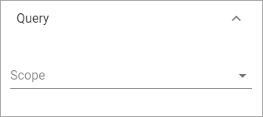
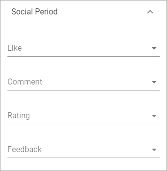
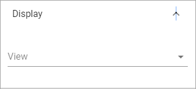
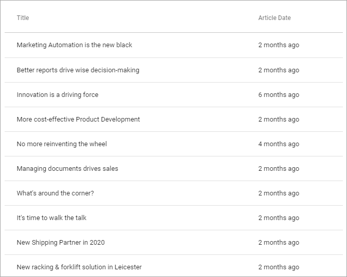
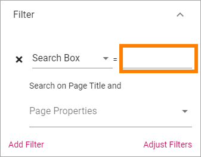
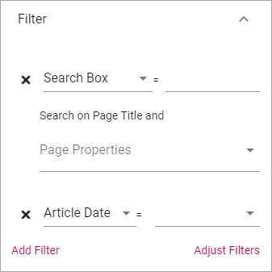
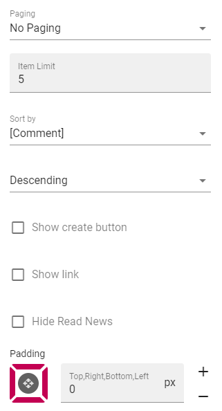
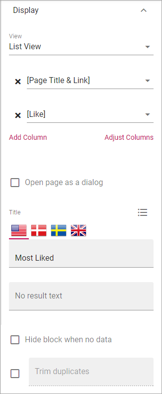

Page Rollup
===========================================

This block can be used for many purposes, for example to rollup new news, latest news and similar - and for much more regarding pages, not just for news.

Settings
*********
These settings are available for the block:

.. image:: page-rollup-settings-new2.png

Query
------
Here you can set the following:

+ **Scope**: Select scope for the block; Publishing Apps or Page Collections. Then open the list below and select Publishing Apps/Page Collections.
+ **Exclude current page**: The default settings is to exclude the current page, but if you, for some reason, would like to include the current page, uncheck this option.

Social Period
--------------
Use these settings to decide for how long likes, comments, ratings and page feedback should be displayed here. The default setting is "No limit" but you can select one week, two weeks or one month instead.

Display
----------
Select View here. Note that a preview is shown in the block.

The following lists all available display settings. Which of them will be available depends on the display selected.

+ **Title**: Select the property that contains the title for the item to display. Available for "Single Item" only.
+ **Description**: Select the property that contains the description for the item(s) to display. Available for "Single Item" only.
+ **Image**: Select the property that contains the image for the item(s) to display.
+ **Date**: Select the property that contains the date for the item(s) to display.
+ **Overlay**: If an overlay text should be shown on the image(s), add the text here. Available for "Roller" only.
+ **Show Likes/Comments**: If the number of likes and comments should be displayed for the item, select this option. 
+ **Show Rating**: If the rating for the page(s) displayed should be shown, select this option. Available for "Listing With Image" only.
+ **Article Date**: Select the property that contains the article date for the item(s) to display. Available for "Single Item" only.
+ **Image x and y**: Select the image format here. Available for "Single Item" only.
+ **Open page as a dialog**: If the page should be opened in a dialog instead for in a page (new or current), select this option. 
+ **Summary**: Select the property that contains the page summary for the item to display. 
+ **Content**: Select the property that contains the page content for the item to display. Available for dialog display only.
+ **Content Image**: Select image to display, if any. Available for dialog display only.
+ **Title**: If a block title should be displayed, enter the title here.
+ **No result text**: Enter the text that will be shown if no page can be displayed.
+ **Hide block when not data**: Select this option if the block should be hidden when there's nothing to display.
+ **Trim duplicates**: Certain settings may result in duplicates being displayed. Select this option to make sure only one copy of the item is displayed.
+ **Paging**: Select paging here; "No paging", "Classic" or "Scroll".
+ **Item limit**: To limit the number of items being displayed, add a fixed number here. Note that if combined with "No paging", the number of items you enter here are the only items users can access from the list.
+ **Sort by**: Choose what the list should be sorted by, and then select ascending or descending.
+ **Show create button**: To make it possible for editors to create a new page from here, select this option to add a button to the block heading, and type the name for the button. Available for "List View" only.
+ **Show link**: You can add a link button at the bottom of the list. The first page collection is default, but you can link to any target.
+ **Link label**: Add the text to be shown for the link here. Available only if "Show link" is selected.
+ **Link url**: Add the url to open when a user clicks the link. Available only if "Show link" is selected.
+ **Open link in new tab**: If the link should be opened in a new tab (as opposed to in current window or dialog), select this option. Available only if "Show link" is selected.
+ **Hide Read News**: If this list displays news, select this option to hide all news pages the logged in user has read.
+ **Padding**: Add some padding between the list and the block border, if needed.

**Note!** For "List View" you also have to add at least one column, for the display to work. Here's an example with two columns added:

.. image:: list-view-columns.png

This could show the following:

"2 months ago" etc is the "Social" setting for date. If you would like to show exact dates instead, select "Normal".

Filter
-------
If users should be able to filter the list, use these options to add filters. A good example of when filters may be needed is in a News Center. See under *Page Rollup Implementations* for an example of how it can look for users.

To add a filter, do the following:

1. Click "Add filter".

.. image:: page-rollup-add-filter.png

2. Open the list and add a property to filter on, or a Search box.

.. image:: page-rollup-add-filter-list.png

3. If you added a Search Box you can set a default search value, meaing this search will be carried out when the page with this block is opened. The user can then execute any search.

4. If you added a Search Box, select additional Text Properties to be searched, if needed. The headings of the pages are always searched. If you select one or more properties here, the text in blocks on pages, using these properties, are also searched.

5. Continue adding filters until you're done.

6. If you added several filters, select "Adjust Filters" the decide the order.

Page Variations
----------------
Using Page Variations you can select the following:

.. image:: page-rollup-variations.png

+ **User Variation**: Pages (incl News) will be listed that correspond with the logged in users preferred setting for the variation, for example language setting, in the user's profile. If some pages does not have a variation that correspond with the user's setting, the default variation will be listed.
+ **Default Variation**: The default variations are always listed.
+ **All Variations**: All variations is listed, meaning several copies of a page can be shown in the list, if the page has variations.

You can find more information about variations under the heading "Variations" on this page: :doc:`Publishing App Settings </pages/publishing-app-settings/index>`

Layout and Advanced
**********************
The tabs Layout and Advanced contain general settings, see: :doc:`General Block Settings </blocks/general-block-settings/index>`

Page Rollup implementations
****************************
In this section we show a number of examples of how the Page Rollup could be implemented.

News Archive/News Center
--------------------------
The purpose of a News Center is to display ALL published news for the users to read. Normally a News Editor can create and edit news artcicles from there.

Here's an example of how the user interface can look:

.. image:: page-rollup-example-news-center.png

(The "Create News Article" button is shown only for those that has the permission to create News.)

The Page Rollup can be set up the following way:

+ Query: Scope - Page Collections, News (the Page Collection with the name "News").
+ Social Period: All default.
+ Display: Depends on how you want it to look. In the above example, these settings are used:

.. image:: news-archive-example-1.png

and these:

.. image:: news-archive-example-2.png

and finally, these:

.. image:: news-archive-example-3.png

Note the "Show create button" option, the label for that button and the option to set in which Page Collection these pages are created (in this case "News", the Page Collection selected under "Query").

+ Filters: A search box is always a good idea in a News Center. The users should most likely also be able to filter the list on one or more properties, for example:

.. image:: news-archive-filters.png

+ Page Variations: None. (If Page variions will be used, for example for different languages, it will be used on the pages. Or a separate News Center could be set up for News in other languages, or for any other purpose, for that matter.)

Latest News
-------------
The purpose of this Page Rollup is as it says - to display a number of the latest News.

It can look like this for users:

.. image:: page-rollup-latest-news-example.png

For this purpose the Page Rollup block can be set up like this:

+ Query: Scope - Page Collections, News.
+ The option "Exclude current page" can be a good idea to have selected. 
+ Social Period: All default.
+ Display: Depends on how you want it to look, of course. In the above example, these settings are used:

.. image:: latest-news-example-1.png

and these:

.. image:: latest-news-example-2.png

+ Filters: none.
+ Page Variations: Default Variations.

Most Commented News
-------------
The purpose of this Page Rollup is as it says - to display a number of the most commented News.

It can look like this for users:

.. image:: page-rollup-example-most-commented-news.png

For this purpose the Page Rollup block can be set up like this:

+ Query: Scope - Page Collections, News.
+ If this block is placed in the Page Type for News, "Exclude current page" can be a good idea to have selected. 
+ Social Period - Comment: If you don't want old comments to affect the list, select a social period.
+ Display: Depends on how you want it to look. In the above example, these settings are used:

.. image:: most-commented-example-1.png

and these:

+ Filters: none.
+ Page Variations: User variation.

Most Liked News
-------------
The purpose of this Page Rollup is as it says - to display a number of the most liked News.

It can look like this for users:

.. image:: page-rollup-most-liked-news-example.png

For this purpose the Page Rollup block can be set up like this:

+ Query: Scope - Page Collections, News.
+ If this block is placed in the Page Type for News, "Exclude current page" can be a good idea to have selected. 
+ Social Period - Like: If you don't want old likes to affect the list, select a social period.
+ Display: Depends on how you want it to look. In the above example, these settings are used:

and these:

.. image:: most-liked-example-2.png

+ Filters: none.
+ Page Variations: User variation.