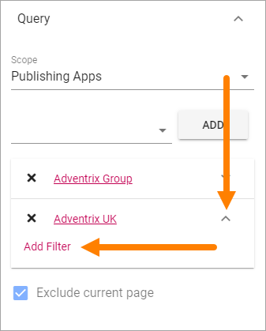
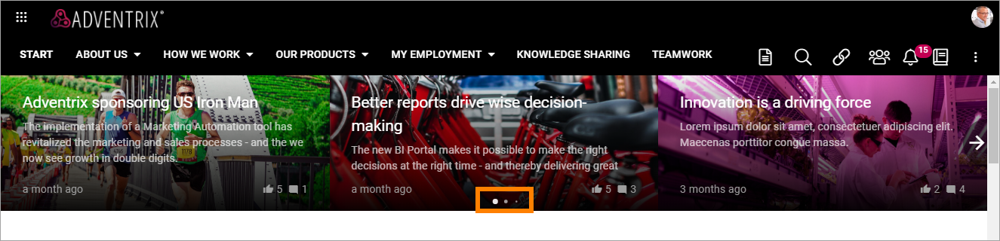
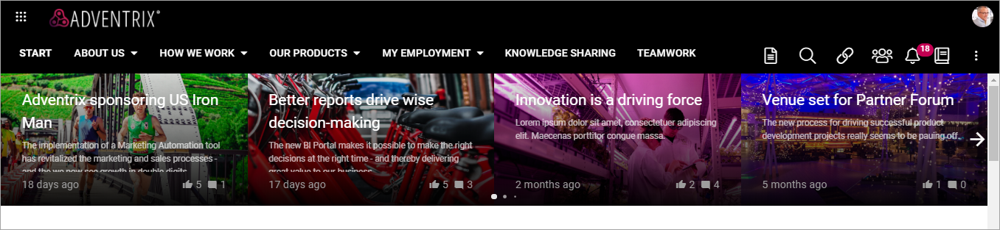
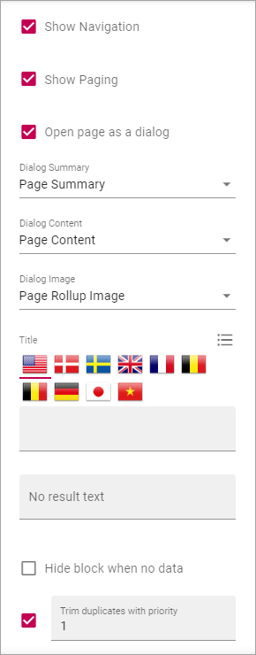

Page Rollup
===========================================

This block can be used for many purposes, for example to rollup new news, latest news and similar - and for much more regarding pages, not just for news.

Settings
*********
These settings are available for the block:

.. image:: page-rollup-settings-new2.png

Query
------
Here you can set the following:

.. image:: page-rollup-settings-query.png

+ **Scope**: Select scope for the block; Publishing Apps or Page Collections. Then open the list below and select Publishing Apps/Page Collections. (Subscriptions is also available in the lists but is not active yet, it's a preparation for functionality to come.)
+ **Exclude current page**: The default settings is to exclude the current page, but if you, for some reason, would like to include the current page, uncheck this option.

When you have selected "Publishing Apps" or "Page Collections" as Scope, use the list to add one or more:

.. image:: page-rollup-query-list.png

For every Publishing App or Page Collection you have selected, you can filter (meaning displaying just some of the pages) by expanding and selecting "Add filter".

Here's an example of a filter that will display pages that have been updated (Modified) the last month:

.. image:: page-rollup-query-filter-example.png

Social Period
--------------
Use these settings to decide for how long likes, comments, ratings and page feedback should be displayed here. The default setting is "No limit" but you can select one week, two weeks or one month instead.

.. image:: page-rollup-settings-social-new.png

Display
----------
Select View here. Note that a preview is shown in the block.

.. image:: page-rollup-settings-display-border.png

The following lists all available display settings (shown in different order for different displays).  

+ **Autoplay**: If the roller should roll automatically, select this option. Available for "Dynamic Roller" only.
+ **Content**: Select the property that contains the page content for the item to display. Available for dialog display only.
+ **Content Image**: Select image to display, if any. Available for dialog display only.
+ **Create button for page collection**: When you have selected "Show create button", this optipon is shown. Use it to select in which page collection the new page will be created.
+ **Date**: Select the property that contains the date for the item(s) to display.
+ **Hide block when not data**: Select this option if the block should be hidden when there's nothing to display.
+ **Hide Read News**: If this list displays news, select this option to hide all news pages the logged in user has read.
+ **Image**: Select the property that contains the image for the item(s) to display.
+ **Image x and y**: Select the image format here. Available for "Single Item" only.
+ **Item limit**: To limit the number of items being displayed, add a fixed number here. Note that if combined with "No paging", the number of items you enter here are the only items users can access from the list.
+ **Link label**: Add the text to be shown for the link here. Available only if "Show link" is selected.
+ **Link url**: Add the url to open when a user clicks the link. Available only if "Show link" is selected.
+ **Loop**: Available for "Roller" and "Dynamic Roller". Normally a roller stops when the last post is reached (and can restart after a short while). When this option is selected, there is no "end" and the roller just keeps rolling. Important note: When Loop is selected the arrows users can use to roll "manually" are not shown.
+ **No result text**: Enter the text that will be shown if no page can be displayed.
+ **Number of slides to display**: Select number of slides, 1-12. Available for "Dynamic Roller" only.
+ **Open link in new tab**: If the link should be opened in a new tab (as opposed to in current window or dialog), select this option. Available only if "Show link" is selected.
+ **Open page as a dialog**: If the page should be opened in a dialog instead for in a page (new or current), select this option. 
+ **Overlay**: If an overlay text should be shown on the image(s), add the text here. Available for "Roller" only.
+ **Paging**: Select paging here; "No paging", "Classic" or "Scroll".
+ **Show create button**: To make it possible for editors to create a new page from here, select this option to add a button to the block heading, and type the name for the button. 
+ **Show Likes/Comments**: If the number of likes and comments should be displayed for the item, select this option. 
+ **Show link**: You can add a link button at the bottom of the list. The first page collection is default, but you can link to any target.
+ **Show Navigation**: If navigation icons for the users to use for rolling should be shown, select this option. Available for "Dynamic Roller" only.
+ **Show Paging**: Available for "Dynamic Roller" only. Small icons shown that users can use to page back and fort. See image below for an example.
+ **Show Rating**: If the rating for the page(s) displayed should be shown, select this option. Available for "Listing With Image" only.
+ **Slider Type**: Select Horisontal slider or Vertical slider. Available for "Dynamic Roller" only.
+ **Slider Size**: Select the size of the slider here: Small, Medium, Large or Extra large. Available for "Dynamic Roller" only.
+ **Sort by**: Choose what the list should be sorted by, and then select ascending or descending.
+ **Summary**: Select the property that contains the page summary for the item to display. 
+ **Title**: If a title should be shown for the block, add it in this field. If no variation exists for the page, you can set the title in the languages active in the tenant. If variations exists, only one title can be set. In that case, titles in other languages are set in the variations.
+ **Trim duplicates**: If more than one Page Rollup block is added to a page, this option can be used to handle duplicates between the blocks. When the option is selected, you can enter a number indicating the priority for duplicates, for this block. If you set "1" for a block it means this block has priority showing a post that would have been a duplicate.

+ **Padding**: Add some padding between the list and the block border, if needed.

**Note!** For "List View" you also have to add at least one column, for the display to work. Here's an example with two columns added:

.. image:: list-view-columns.png

This could show the following:

.. image:: list-view-example.png

"2 months ago" etc is the "Social" setting for date. If you would like to show exact dates instead, select "Normal".

"Show paging" in settings for "Dynamic Roller" makes these icons available for navigation:

Filter
-------
If users should be able to filter the list, use these options to add filters. A good example of when filters may be needed is in a News Center. See under *Page Rollup Implementations* for an example of how it can look for users.

To add a filter, do the following:

1. Click "Add filter".

.. image:: page-rollup-add-filter.png

2. Open the list and add a property to filter on, or a Search box.

.. image:: page-rollup-add-filter-list.png

3. If you added a Search Box you can set a default search value, meaning this search will be carried out when the page with this block is opened. The user can then execute any search.

.. image:: page-rollup-search-default.png

4. If you added a Search Box, select additional Text Properties to be searched, if needed. The headings of the pages are always searched. If you select one or more properties here, the text in blocks on pages, using these properties, are also searched.

5. Continue adding filters until you're done.

.. image:: page-rollup-add-filter-done.png

6. If you added several filters, select "Adjust Filters" the decide the order.

Page Variations
----------------
Using Page Variations you can select the following:

.. image:: page-rollup-variations.png

+ **User Variation**: Pages (including News) will be listed that correspond with the logged in users preferred setting for the variation, for example language setting, in the user's profile. If some pages does not have a variation that correspond with the user's setting, the default variation will be used.
+ **Default Variation**: The default variations are always used.
+ **All Variations**: All variations are used, meaning several copies of a page can be shown in the list, if the page has variations.

You can find more information about variations under the heading "Variations" on this page: :doc:`Publishing App Settings </pages/page-settings/index>`

Layout and Advanced
**********************
The tabs Layout and Advanced contain general settings, see: :doc:`General Block Settings </blocks/general-block-settings/index>`

Page Rollup implementations
****************************
In this a number of examples of how the Page Rollup could be implemented are described.

News Archive/News Center
--------------------------
The purpose of a News Center is to display ALL published news for the users to read. Normally a News Editor can create and edit news artcicles from there.

Here's an example of how the user interface can look:

.. image:: page-rollup-example-news-center.png

(The "Create News Article" button is shown only for those that has the permission to create News.)

The Page Rollup can be set up the following way:

+ Query: Scope - Page Collections, News (the Page Collection with the name "News").
+ Social Period: All default.
+ Display: Depends on how you want it to look. In the above example, these settings are used:

.. image:: news-archive-example-1.png

and these:

.. image:: news-archive-example-2.png

and finally, these:

.. image:: news-archive-example-3.png

Note the "Show create button" option, the label for that button and the option to set in which Page Collection these pages are created (in this case "News", the Page Collection selected under "Query").

+ Filters: A search box is always a good idea in a News Center. The users should most likely also be able to filter the list on one or more properties, for example:

.. image:: news-archive-filters.png

+ Page Variations: None. (If Page variions will be used, for example for different languages, it will be used on the pages. Or a separate News Center could be set up for News in other languages, or for any other purpose, for that matter.)

Latest News
-------------
The purpose of this Page Rollup is as it says - to display a number of the latest News.

It can look like this for users:

.. image:: page-rollup-latest-news-example.png

For this purpose the Page Rollup block can be set up like this:

+ Query: Scope - Page Collections, News.
+ The option "Exclude current page" can be a good idea to have selected. 
+ Social Period: All default.
+ Display: Depends on how you want it to look, of course. In the above example, these settings are used:

.. image:: latest-news-example-1.png

and these:

.. image:: latest-news-example-2.png

+ Filters: none.
+ Page Variations: Default Variations.

Most Commented News
----------------------
The purpose of this Page Rollup is as it says - to display a number of the most commented News.

It can look like this for users:

.. image:: page-rollup-example-most-commented-news.png

For this purpose the Page Rollup block can be set up like this:

+ Query: Scope - Page Collections, News.
+ If this block is placed in the Page Type for News, "Exclude current page" can be a good idea to have selected. 
+ Social Period - Comment: If you don't want old comments to affect the list, select a social period.
+ Display: Depends on how you want it to look. In the above example, these settings are used:

.. image:: most-commented-example-1.png

and these:

.. image:: most-commented-example-2.png

+ Filters: none.
+ Page Variations: User variation.

Most Liked News
-----------------
The purpose of this Page Rollup is as it says - to display a number of the most liked News.

It can look like this for users:

.. image:: page-rollup-most-liked-news-example.png

For this purpose the Page Rollup block can be set up like this:

+ Query: Scope - Page Collections, News.
+ If this block is placed in the Page Type for News, "Exclude current page" can be a good idea to have selected. 
+ Social Period - Like: If you don't want old likes to affect the list, select a social period.
+ Display: Depends on how you want it to look. In the above example, these settings are used:

.. image:: most-liked-example-1.png

and these:

.. image:: most-liked-example-2.png

+ Filters: none.
+ Page Variations: User variation.

News - Dynamic Roller
------------------------
When a Dynamic Roller display is used for news, it can look lik this:

In this example the Page Rollup block is set up this way:

+ Query: Scope - Page Collections, News.
+ If this block is placed in the Page Type for News, "Exclude current page" can be a good idea to have selected. 
+ Social Period - Like: If you don't want old likes to affect the list, select a social period.
+ Display: Depends on how you want it to look. In the above example, these settings are used:

.. image:: dynamic-roller-example-1.png

and these:

and, finally, these:

.. image:: dynamic-roller-example-3.png

+ Filters: none.
+ Page Variations: User variation.
