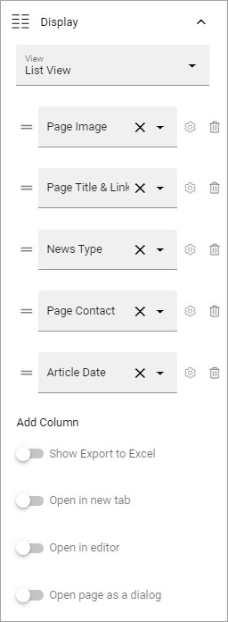
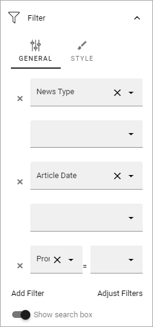
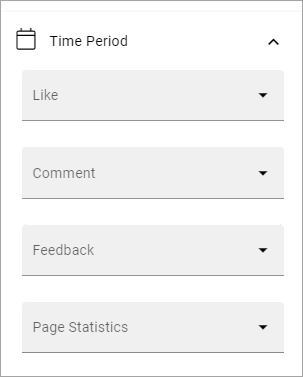
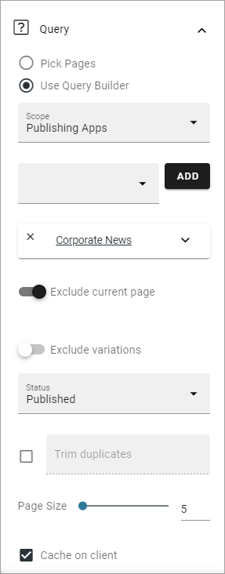
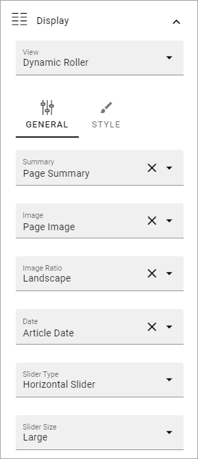
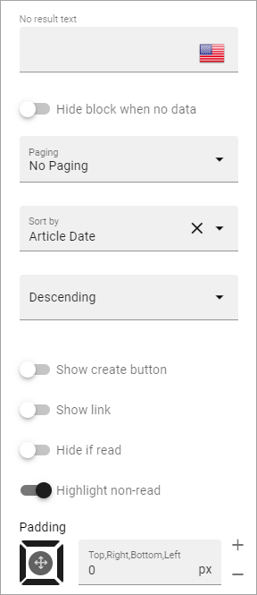
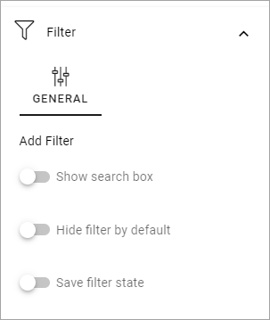
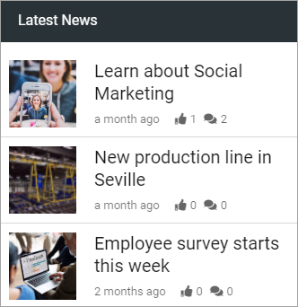
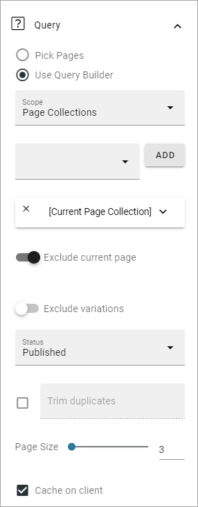
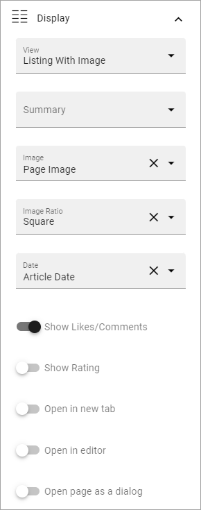

Page Rollup implementation examples
==============================================

Here you will find some examples of how the Page Rollup block can be used. 

News Archive/News Center
--------------------------
The purpose of a News Center is to display ALL published news, or a specific type of news, for the users to read. Normally a News Editor can create and edit news artcicles from there. 

Here's an example of how the user interface can look:

.. image:: page-rollup-example-news-center-610-new.png

(The "Create News Article" button is shown only for those that has the permission to create News.)

The News Center in this example consists of several parts. The Page Rollup block is used for two different purposes; 1) the list with the search field and filter, 2) as part of a Newsletter implementation. Here the news list is described.

.. image:: page-rollup-example-news-center-610-rollup-new.png

The Page Rollup for the news list is set up the following way in this example:

+ Query: Scope - Page Collections, Current Page Collection (this is a Page Collection for Corporate news only).
+ The option "Exclude current page" can be a good idea to have selected. 
+ Only published news should be listed, as this is a list for all users.

.. image:: news-example-query.png

+ Display: Depends on how you want it to look. In the above example, these settings are used:

There are five columns added. As it's a List View, at least one column must always be added or nothing is shown.

and these:

.. image:: news-example-display-2-new.png

+ Filters: A search box is always a good idea in a News Center. The users should most likely also be able to filter the list on one or more properties, for example:

The rest of the Filter settings are:

.. image:: news-example-filters-2-new.png

"Enable partial word search" should probably always be selected in a news rollup implementation, so the search can find parts of words as well. As "Hide filter by default" is selected, users have to click SHOW FILTER to be able to filter. Makes the layout a bit cleaner. "Save filter state" makes the filter keeps it’s state in the page url as long as the page is active, and the url can be copied.

+ Time Period - all default (no limit), meaning all published news are always listed, whenever they where published and so on.

News - Dynamic Roller
------------------------
When a Dynamic Roller display is used for news, it can look like this:

.. image:: dynamic-roller-example-new2.png

In this example the Page Rollup block is set up this way:

+ Query: Scope - Page Collections, Corporate News (this is page collection specifically for corporate news).
+ "Exclude current page" is always a good idea for news. 

+ Display: the Dynamic Roller settings are these:

and these:

.. image:: dynamic-roller-displpay-2.png

and, finally, these:

+ Filters: none.

+ Time Period: none (meaning all published news from this page collection are shown).

.. image:: dynamic-roller-timeperdiod.png

Latest News
-------------
The purpose of this Page Rollup is as it says - to display a number of the latest News.

It can look like this for users:

In this example the Page Rollup block has been set up this way in a Tenant Page Type:

+ Query:

The Page Size: 3 settings means that the three latest news articles always are listed.

+ The settings for Display are these:

and these:

.. image:: latest-news-display-2.png

+ Filters: none. (This rollup are just supposed to display the three latest news articles, nothing else).

+ Time Period: none.

