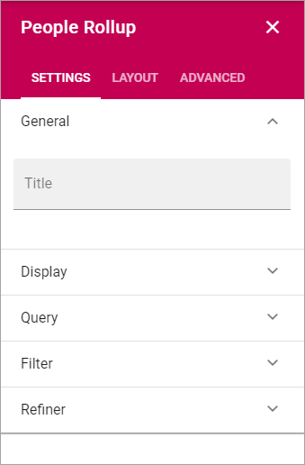

People Rollup
===========================================

Use this block to display lists of people, for many various reasons.

Settings
*************************
The following settings are available:

General
----------------
Here you can add a Title to be displayed for the block:

.. image:: peoplerollup-settings-general.png

Display
-----------
You will be able set the type fo view to be used for the list here (only Card display available at the moment):

.. image:: peoplerollup-settings-display.png

Query
-----------
Here you can work with the Query for what to display in the block.

.. image:: peoplerollup-settings-query.png

**A description will be added here soon.**

Filter
-------
Use these settings to add filters for the users to use.

.. image:: peoplerollup-settings-filter.png

+ **Position**: Decide where to place the filters; top, left or right.
+ **Add filter**: Click this button to add a filter.

Refiner
---------
Use these settings to add refiners.

.. image:: peoplerollup-settings-refiner.png

+ **Position**: Decide where to out the refiners; top, left or right.
+ **Add refiner**: Click this button to add a refiner.

Layout and Advanced
**********************
The tabs Layout and Advanced contain general settings, see: :doc:`General Block Settings </blocks/general-block-settings/index>`

