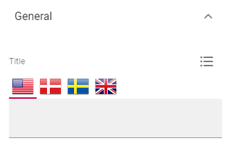
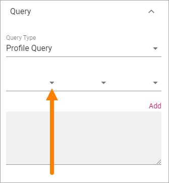
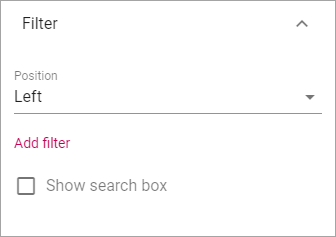
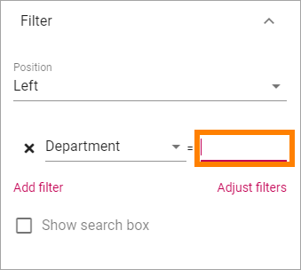

People Rollup
===========================================

Use this block to display lists of people, for many various reasons. Here are a few examples of implementations:

+ Display contact person for a page or for something else.
+ List colleagues working at a particular office.
+ List members or owners in a group site.
+ Create a people directory.

Here are two examples of the user interface. New Recruitments and People on the Move are different People Rollup blocks.

.. image:: people-rollup-example.png

Settings
*************************
The following settings are available:

.. image:: peoplerollup-settings-new2.png

General
----------------
Here you can add a Title to be displayed for the block:

If no varition exists for the page, it looks like in the image above and you can set the title in the languages active in the tenant. If a varition exists, only one title can be set. In that case, titles in other languages are set in the variations.	

Display
-----------
You can set the type of view to be used for the list here:

.. image:: peoplerollup-settings-display.png

You can choose to display the list as a Card view or Roller view.

In the image at the top of the page, Card view is used. See below for a Roller example.

The following settings are available for the views:

+ **Add Column**: This is not columns in columns in a table. Think: What information do I want to show about the people? You must always add at least one column or nothing will be shown!
+ **Person Name**: Select property to get the Person Name from.
+ **Show Profile Image**: Select this option to show the person's image.
+ **Slide Height**: Set the height of the area to show the content in. Available for Roller view only.
+ **Alignment Option**: Set vertical alignment for the content. Available for Roller view only.
+ **Justify Options**: Set horizontal alignment for the content. Available for Roller view only.
+ **Show Achivements**: This option is a preparation for functionality to come. Available for Card view only.
+ **Max no of Columns**: Set the maximum number of columns to be displayed.
+ **Sort By**: Select the property to sort the list by.
+ **Paging**: Select how paging should work; “No Paging”, “Classic” or “Scroll”. See below for examples. Scroll is note applicabale for Roller view.
+ **Item Limit**: To limit the number of items being displayed, add a fixed number here. If you set a high number (for example the default, 50) as many people as meets the query criteria is shown, up to that number. If you set a low number, that is the number of people tha list will show, regardless of how many meets the query criteria. Set 0 for no Item Limit.
+ **Left Zone Width, Right Zone Width**: Here you can set the width od the left and right zones manually, in pixels, if needed.

Here's an example of a  Roller view, with Slide Height 150, Alignment Center, Justify Center, No Paging and Item Limit 5.

.. image:: roller-view.png

Here's an example of a Classic view (note the page icons at the bottom):

.. image:: people-rollup-classic-view.png

**Important note on "No Paging"**: If you choose "No paging" and set "Item Limit" to a specific number, that is the number of people that will be available in the list, regardless of how many that actually meets the search criteria.

Query
-----------
Here you can work with the Query for what to display in the block.

.. image:: peoplerollup-settings-query.png

Follow these steps:

1. Select Query Type, Profile Query or Activity Query.
2. If you selected Activity Query, choose Activity period (also called Social Period in some other blocks). This sets how old the item can be to be displayed in the list. The default is "No limit", but you c an also select One Week, Two Weeks or One Month.
3. Select property for the query.

.. image:: query-property-2.png

4. Set additional query parameters. Exactly what needs to be done depends on the property chosen.

Here's an example with parameters set for Department:

.. image:: query-parameters.png

5. Type a parameter if neded (needed for Manual or Query Parameter).

.. image:: query-type-parameter.png

6. Click "ADD" to add the query from your settings.

.. image:: query-add.png

It can result in something like this:

.. image:: query-added.png

Note that you can type the script directly in the field, if you know how. You can use all options in the Keyword Query Language (KQL). See this Microsoft page for reference: https://docs.microsoft.com/en-us/sharepoint/dev/general-development/keyword-query-language-kql-syntax-reference

You can also add additional parameters. by using the method explained above or typing directly in the field. Here's an example when the script collects users from two departments:

.. image:: query-more.png

Filter
-------
Use these settings to add filters for the users to use. An example could be if a People Rollup block displays all colleagues in different departments, you may want to display a filter for departments so user can display a list of only colleagues in a certain department.

+ **Position**: Decide where to place the filters; top, left or right. Tip! The Top position for filters is most likely the best for this block.
+ **Add filter**: Click this button to add a filter.
+ **Show Search Box**: To display a Search Box so users can search the list, select this option.

To add a new filter, do the following:

1. Click "Add filter".

.. image:: click-add-filter.png

2. Open the list and select a property to filter on.

.. image:: people-add-filter.png

3. Add additional filter settings if needed.

4. Continue and add all filters the same way.

**Important note on query and search**: If the query sets a limit of users that can meet the search criteria, the search can only be done within that limited group.

Refiner
---------
Use these settings to add refiners.

.. image:: peoplerollup-settings-refiner.png

+ **Position**: Decide where to put the refiners; top, left or right. 

To add a refiner, do the following:

1. Set position for the refiner(s).
2. Click "Add refiner".

.. image:: people-rollup-add-refiner.png

3. Open the list and select a property as refiner.

.. image:: people-rollup-add-refiner-list.png

4. Select sorting and limit, if needed.

.. image:: people-rollup-add-refiner-sort.png

5. Add eventual additional refiners the same way.
6. If you have added more than one refiner, use "Adjust refiners" to decide the order.

Here's an example of a refiner present at the top. Users can choose to show colleagues from just one of the two departements:

.. image:: people-rollup-example-refiners.png

Layout and Advanced
**********************
The tabs Layout and Advanced contain general settings, see: :doc:`General Block Settings </blocks/general-block-settings/index>`

