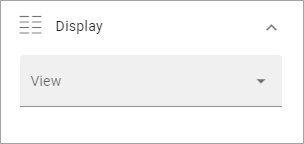
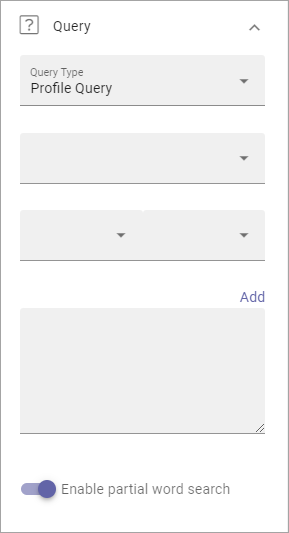
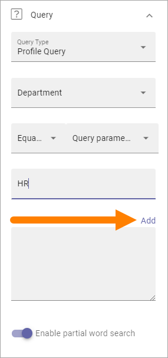

People Rollup
===========================================

Use this block to display lists of people, for many various reasons. Here are a few examples of implementations:

+ Display contact person for a page or for something else.
+ List colleagues working at a particular office.
+ List members or owners in a group site.
+ Create a people directory.

Here are two examples of the user interface. New Recruitments and People on the Move are different People Rollup blocks. The view used here is Card.

.. image:: people-rollup-example-new.png

Settings
*************************
The following settings are available:

.. image:: peoplerollup-settings-new3.png

General
----------------
Here you can add a Title to be displayed for the block:

.. image:: peoplerollup-settings-general-new2.png

If no varition exists for the page, it looks like in the image above and you can set the title in the languages active in the tenant. If a varition exists, only one title can be set. In that case, titles in other languages are set in the variations.	

Display
-----------
You can set the type of view to be used for the list here:

You can choose to display the list as a Card view or Roller view.

In the image at the top of the page, Card view is used. See below for a Roller example.

The following settings are available for the views:

+ **Add Column**: This is not like columns in columns in a table. You should think: What information do I want to display about the people? You must always add at least one column or nothing will be shown!
+ Adjust Columns**: Use this option the order in which the selected columns are shown.
+ **Person Name**: Select property to get the Person Name from.
+ **Show Profile Image**: Select this option to show the person's image.
+ **Open in Dialog**: If you select this option, the person's information is opened in a dialog instead of in a window, when clicked.
+ **Dialog Position**: Here you can set the position for the dialog; Center, Left or Right.
+ **Open in New tab**: If you select this option, the person's information is opened in a new tab instead of in a window, when clicked. 
+ **Auto Cycle**: Available for Roller. Select this option to make the roller auto cycle through availble persons.
+ **Slide Height**: Set the height of the area to show the content in. Available for Roller view only.
+ **Alignment Option**: Set vertical alignment for the content. Available for Roller view only.
+ **Justify Options**: Set horizontal alignment for the content. Available for Roller view only.
+ **Show Achivements**: This option is a preparation for functionality to come. Not used yet. Available for Card view only.
+ **Max no of Columns**: Set the maximum number of columns to be displayed.
+ **Sort By**: Select the property to sort the list by.
+ **Paging**: Select how paging should work; “No Paging”, “Classic” or “Scroll”. See below for examples. Scroll is note applicabale for Roller view.
+ **Page Size**: To limit the number of items being displayed per "page", add a fixed number here. Works together with Paging. 
+ **Padding**: Use this option to add some padding between the list and the border of the block, if needed.

Here's an example of a Roller view (will be added soon).

(Image to be added))

**Important note on "No Paging"**: If you choose "No paging" and set "Item Limit" to a specific number, that is the number of people that will be available in the list, regardless of how many that actually meets the search criteria.

Query
-----------
Here you can work with the Query for what to display in the block.

Follow these steps:

1. Select Query Type; "Profile Query", "Sharepoint Groups", "User Fields on Page" or "Activity Query".
2. If you selected Activity Query, choose Activity period (also called Social Period in some other blocks). This sets how old the item can be to be displayed in the list. The default is "No limit", but you c an also select One Week, Two Weeks or One Month.
3. Select property for the query.

.. image:: query-property-1-new.png

4. Set additional query parameters. Exactly what needs to be done depends on the property chosen.

Here's an example with parameters set for Department:

.. image:: query-parameters-new.png

5. Type a parameter if neded (needed for Manual or Query Parameter).

.. image:: query-type-parameter-new.png

6. Click "ADD" to add the query from your settings.

It can result in something like this:

.. image:: query-added-new.png

Note that you can type the script directly in the field, if you know how. You can use all options in the Keyword Query Language (KQL). See this Microsoft page for reference: https://docs.microsoft.com/en-us/sharepoint/dev/general-development/keyword-query-language-kql-syntax-reference

You can also add additional parameters, by using the method explained above or typing directly in the field. Here's an example when the script that collects users from two departments:

.. image:: query-more-new.png

7. If partial word search should be executed in the query, select that option. 

Filter
-------
Use these settings to add filters for the users to use. An example could be if a People Rollup block displays all colleagues in different departments, you may want to display a filter for departments so user can display a list of only colleagues in a certain department.

.. image:: peoplerollup-settings-filter-new3.png

For more information on how to add filters, or a search box, see this page: :doc:`Filter UI </blocks/general-block-settings/filters/index>`

Refiner
---------
Use these settings to add refiners.

.. image:: peoplerollup-settings-refiner-new.png

+ **Position**: Decide where to put the refiners; top, left or right. 

To add a refiner, do the following:

1. Set position for the refiner(s).
2. Click "Add refiner".

.. image:: people-rollup-add-refiner-new.png

3. Open the list and select a property as refiner.

.. image:: people-rollup-add-refiner-list-new.png

4. Select sorting and limit, if needed.
5. Click Add refiner.

.. image:: people-rollup-add-refiner-sort-new.png

6. Add eventual additional refiners the same way.
7. If you have added more than one refiner, use "Adjust refiners" to decide the order.
8. For additional settings, click Style.

.. image:: people-rollup-style.png

Here's an example of a refiner present at the top. Users can choose to show colleagues from just one of the two departements:

.. image:: people-rollup-example-refiners-new.png

Layout and Advanced
**********************
The tabs Layout and Advanced contain general settings, see: :doc:`General Block Settings </blocks/general-block-settings/index>`

