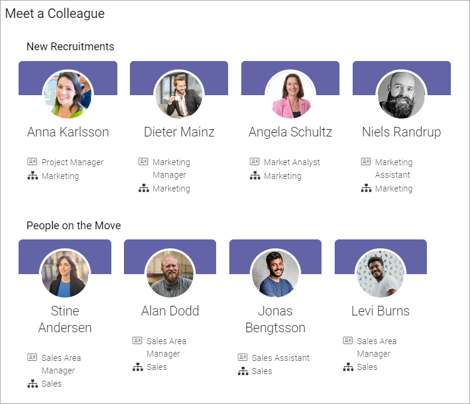
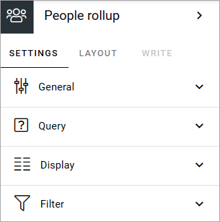
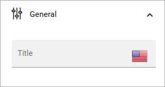
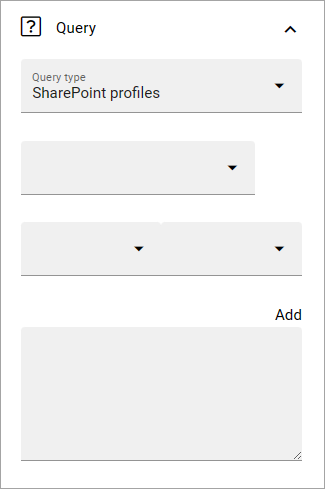
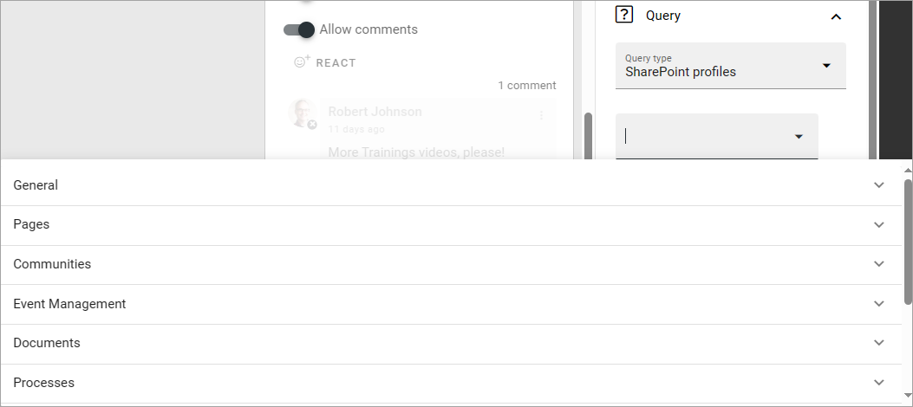
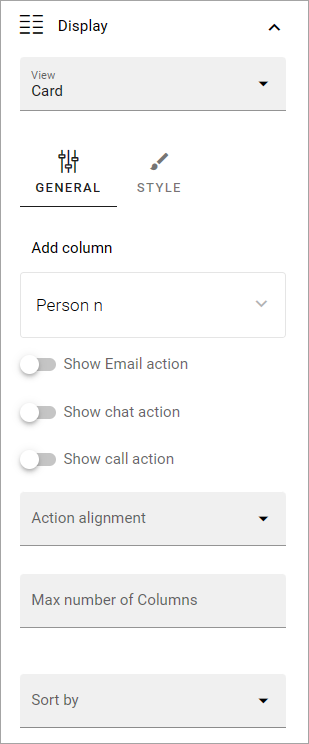
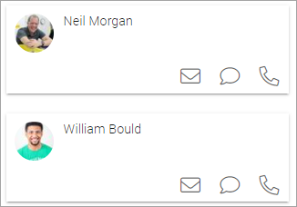
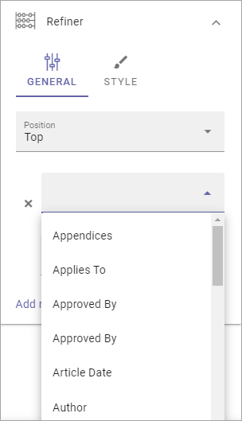
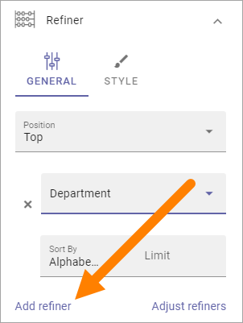
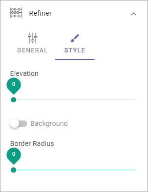

People rollup
===========================================

Use this block to display lists of people, for many various reasons. Here are a few examples of implementations:

+ Display contact person for a page or for something else.
+ List colleagues working at a particular office.
+ List members or owners in a group site.
+ A people directory.

Here are two examples of the user interface. "New recruitments" and "People on the move" are different people rollup blocks. The view used here is Card.

Settings
*************************
The following settings are available (up to v7):

.. image:: peoplerollup-settings-new4.png

Available settings in Omnia 7.5 are these:

General
----------------
Here you can add a title to be displayed for the block:

You can add a title in any or all languages available in the tenant. As usual, click the flag to change language.	

Query
-----------
Here you can work with the Query for what to display in the block.

**Important Note!** The query type SharePoint groups is limited to list approximately 50 users. If the group contains more users than can be listed, you may get the following error: "The query failed - The maximum allowed value is 4096 Parameter name: QueryTemplate". If you run into this limitation, please use the Profile query instead.

Follow these steps:

1. Select Query type; "Sharepoint profiles", "SharePoint groups", "User property on page", "Activity query", "Upcoming birthdays" or "Users". Selecting "Users" you can rollup Omnia users as set up in User Management. Note that the tenant feature "People rollup query type for users" must be active for "Users" to be available here.
2. If you selected Activity query, choose Activity period (also called Social period in some other blocks). This sets how old the item can be to be displayed in the list. The default is "No limit", but you can also select One week, Two weeks or One month. If you selected Upcoming birthdays query you choose the property to be used for birthdays and birthday period.
3. Select property for the query.

4. Set additional query parameters. Exactly what needs to be done depends on the property chosen.
5. Type a parameter if neded (needed for Manual or Query parameter).
6. Click "ADD" to add the query from your settings.

It can result in something like this:

.. image:: query-added-new2.png

Note that you can type the script directly in the field, if you know how. You can use all options in the Keyword Query Language (KQL). See this Microsoft page for reference: https://docs.microsoft.com/en-us/sharepoint/dev/general-development/keyword-query-language-kql-syntax-reference

You can also add additional parameters, by using the method explained above or typing directly in the field. Here's an example when the script collects users from two departments:

.. image:: query-more-new.png

Display
-----------
You can set the type of view to be used for the list here (Card chosen as an example):

You can choose to display the list as a Card view or Roller view. 

The following settings are available for the views:

+ **Add column**: This is not like columns in columns in a table. You should think: What information do I want to display about the people? You must always add at least one column or nothing will be shown!
+ **Show Email action**: Available for Card. Makes it possible to send an email directly from the card. **General note**: For a user to be able to receive emails, the acccount must be email enabled.
+ **Show Chat action**: Available for Card. Makes it possible to start a MS Teams chat with the colleague directly from the card.
+ **Show Call action**: Available for Card. Makes it possible to start a call with the colleague directly from the card. The system uses the unit's default app for calls. If Omnia is used through Teams, the call should normally be made through Teams automatically.
+ **Action alignment**: Available when any or all the above actions are selected. Use this option to set alignment for the actions.
+ **Adjust columns**: Use this option the order in which the selected columns are shown.
+ **Person name**: Select property to get the person name from.
+ **Show profile image**: Select this option to show the person's profile image.
+ **Open in dialog**: If you select this option, the person's information page is opened in a dialog instead of in a window, when clicked (either the User profile card or the Delve page, depending on set up). 
+ **Dialog position**: Here you can set the position for the dialog; Center, Left or Right.
+ **Open in new tab**: If you select this option, the person's information page is opened in a new tab instead of in a window, when clicked. (either the User profile card or the Delve page, depending on set up). 
+ **Auto cycle**: Available for Roller. Select this option to make the roller auto cycle through available persons.
+ **Slide height**: Set the height of the area to show the content in. Available for Roller view.
+ **Alignment option**: Set vertical alignment for the content. Available for Roller.
+ **Justify options**: Set horizontal alignment for the content. Available for Roller view.
+ **Show achivements**: This option is a preparation for functionality to come. Not used yet. Available for Card view only.
+ **Max no of columns**: Set the maximum number of columns to be displayed.
+ **Sort by**: Select the property to sort the list by.
+ **Style**: Style (the field) - Here you can choose to display a Mail Icon that the users can click to send an Email to a person. See below for an example.
+ **Left zone width**: Available for Roller. Set the width of the zone to the left of the person shown.
+ **Right zone width**: Available for Roller. Set the width of the zone to the right of the person shown.
+ **Paging**: Select how paging should work; “No paging”, “Classic” or “Scroll”. See below for examples. Scroll is note applicabale for Roller view.
+ **Page size**: To limit the number of items being displayed per "page", add a fixed number here. Works together with Paging. 
+ **Padding**: Use this option to add some padding between the list and the border of the block, if needed.

**Important note on "No paging"**: If you choose "No paging" and set "Item limit" to a specific number, that is the number of people that will be available in the list, regardless of how many that actually meets the search criteria.

Here's an example with a simple Card View displaying the three icons:

Filter
-------
Use these settings to add filters for the users to use. An example could be if a People rollup block displays all colleagues in different departments, you may want to display a filter for departments so user can display a list of only colleagues in a certain department. These settings are available up to Omnia 6.13:

.. image:: peoplerollup-settings-filter-new3.png

For more information on how to add filters, or a search box, see this page: :doc:`Filter UI </blocks/general-block-settings/filters/index>`

In Omnia 7.0 and later, new options for filtering are available, see: :doc:`Filter options for blocks in Omnia v7 </blocks/general-block-settings/filter-options-block/index>`

Refiner
---------
Use these settings to add refiners in Omnia versions up to 6.13. 

.. image:: peoplerollup-settings-refiner-new.png

+ **Position**: Decide where to place the refiners; Top, Left or Right. 

To add a refiner, do the following:

1. Set position for the refiner(s).
2. Click "Add refiner".

.. image:: people-rollup-add-refiner-new.png

3. Open the list and select a property as refiner.

4. Select sorting and limit, if needed.
5. Click "Add refiner".

6. Add additional refiners the same way, if needed.
7. If you have added more than one refiner, use "Adjust refiners" to decide the order.
8. For additional settings, click "Style".

+ **Elevation**: If you want the refiner area to be elevated, use this slider to set how much.
+ **Background**: Use this option to add a gray tint to the refiner area, to make it a little bit darker than the rest of the block. If the background for the block is white the refiner area is distinctively gray. If the background for the block is black this option makes no difference.
+ **Border radius**: Use this slider to set rounded corners for the Refiner area.

Here's an example of a refiner present at the top. Users can choose to show colleagues from just one of the two departements:

.. image:: people-rollup-example-refiners-new.png

In Omnia 7.0 and later, the Refiner menu option is removed. Refiner options can now be found under "Filter", see: :doc:`Filter options for blocks in Omnia 7.0 </blocks/general-block-settings/filter-options-block/index>`

Layout and Write
*********************
The WRITE Tab is not used here. The LAYOUT tab contains general settings, see: :doc:`General block settings </blocks/general-block-settings/index>`

