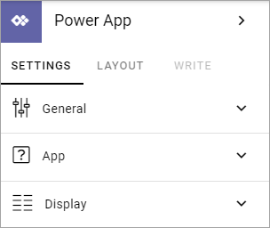
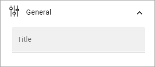
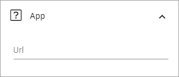
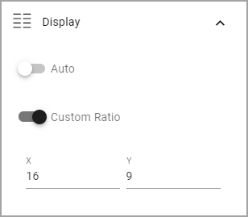

Power app block
=====================

Use this block to add an app built according to Microsoft's Power App framework.

Settings
****************
The following settings are available:

General
--------
Here you can add a title for the block.

App
-----
Add the URL to the app here.

When you have added the URL you will be able to set some colors. 

Display
--------
The settings for Display are these:

+ **Auto**: If you want the ratio for the block set automatically, select this option.
+ **Custom ratio**: If you want to set a custom ratio, select this option and enter x and y values.
