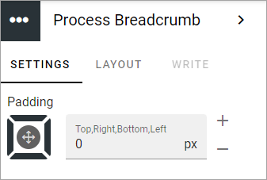

Process breadcrumb block
==========================

This block is used to show the breadcrumb on a process page. Heres an example:

The only thing you can set is some padding if needed.

Layout and Write
*********************
The WRITE Tab is not used here. The LAYOUT tab contains general settings, see: :doc:`General block settings </blocks/general-block-settings/index>`
