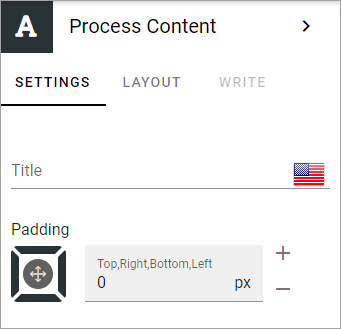

Process content block
=======================

Use this block to display the process content - the content added on the Content tab by the process author.

You can add a title in any or all available languages, and add some padding, if needed.

Layout and Write
*********************
The WRITE Tab is not used here. The LAYOUT tab contains general settings, see: :doc:`General block settings </blocks/general-block-settings/index>`
