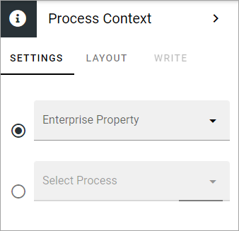

Process context block
=======================

You use this block to make sure the property process is available on the Properties tab for the page, so the page can be linked to the intended process. If you create a page to display a specific process, this is absolutely necessary so the various blocks will be populated with data from the process.

+ **Enterprise property**: You can add the enterprise property to get the process from or use the next field. 
+ **Select process**: You can instead use this field to select the process that should be placed into context. You search in the field for the process name.

**Note!** On a page where you plan to add a process rollup, you can NOT use this block.

Layout and Write
*********************
The WRITE Tab is not used here. The LAYOUT tab contains general settings, see: :doc:`General block settings </blocks/general-block-settings/index>`

