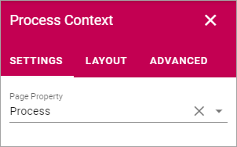

Process Context block
=======================

You use this block to make sure the Property Process is available on the Properties tab för the page, so the page can be linked to the intended process.

Just select "Process" for Page Property and your done.

**Note!** On a page where you plan to add a Process Rollup, you can NOT use this block.

Layout and Advanced
********************
The tabs Layout and Advanced are standard tabs, available for most blocks. For more information, see: :doc:`General Block Settings </blocks/general-block-settings/index>`

