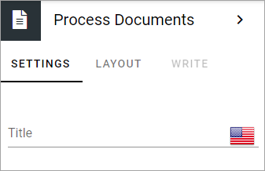

Process Documents block
=========================

You use this block to display the documents relevant to the process, that was added on the Documents tab by the process author.

You can add a title for the block, in any or all available languages, if nedded.

Layout and Write
*********************
The WRITE Tab is not used here. The LAYOUT tab contains general settings, see: :doc:`General Block Settings </blocks/general-block-settings/index>`
