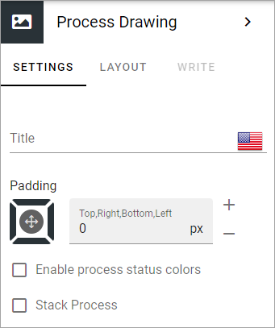
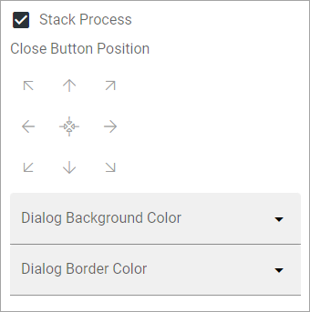
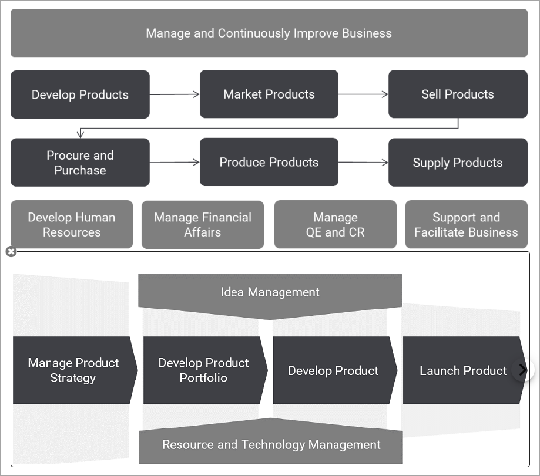
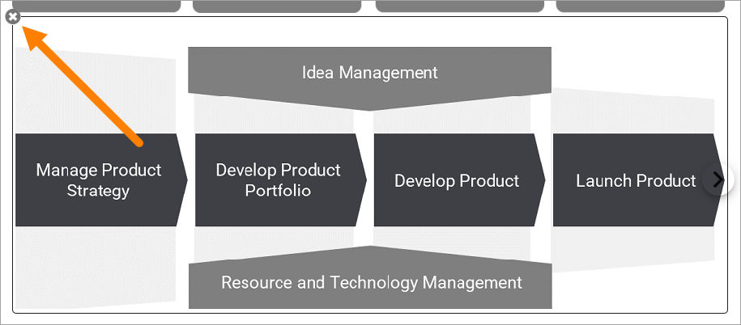

Process Drawing block
======================

Use this block to display the process drawing for the process. The process is not set in the block, it's set on the Properties tab of the page, see this page for more information: :doc:`Displaying processes for users </working-with-processes/displaying-processes-for-users/index>`

Settings
***********
The block has the following settings:

+ **Title**: You can add a title in any or all the available languages, and add some padding, if nedded.
+ **Padding**: Add some padding between the block frame and the content, if needed.
+ **Enable process status colors**: (A description will be added soon).
+ **Stack Process**: Normally when you select a sub process, the drawing for the main process is closed. Select this option if you want the main process's drawing, and all the drawings for the selected steps, to be shown at the same time. 

When you select "Stack Process" additional options are available:

Use them to set the postion for the close button and to set colors.

Here's an example when Stack Process is selected. Develop Products is selected in the main process and both that drawing and the drawing for Develop product are shown.

The user can close the drawing for a sub process by clicking the x.

Layout and Write
*********************
The WRITE TAB is not used here. The LAYOUT tab contains general settings, see: :doc:`General Block Settings </blocks/general-block-settings/index>`

