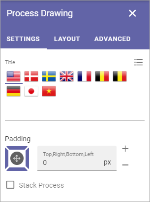

Process Drawing block
======================

Use this block to display the process drawing for the process.

Settings
***********
The block has the following settings:

+ **Title**: You can add a title in any or all the available languages, and add some padding, if nedded.
+ **Padding**: Add some padding between the block frame and the content, if needed.
+ **Stack Process**: Normally when you select a sub process, the drawinf for main process is closed, and the drawing for the main process is not shown. Select this option if you want the main process's drawing, and all the drawings for the selected steps, to be shown at the same time. 

Here's an example when Stack Process is selected. Develop Products is selected in the main process and both that drawing and the drawing for Develop product are shown.

.. image:: stack-process-example.png

The user can close the drawing for a sub process by clicking the x

.. image:: stack-process-close.png

Layout and Advanced
********************
The tabs Layout and Advanced are standard tabs, available for most blocks. For more information, see: :doc:`General Block Settings </blocks/general-block-settings/index>`

