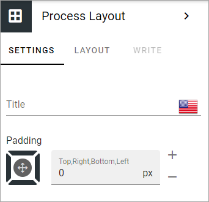

Process layout block
================================================

Use this block to display the whole process on a page. Must be combined with the Process context block.

Settings
************
The only specific setting you can do is to add a title for the block in any tenant language.

Layout and Write
----------------------
The WRITE Tab is not used here. The LAYOUT tab contains general settings, see: :doc:`General block settings </blocks/general-block-settings/index>`

See this page for more information: :doc:`Process context block </blocks/process-blocks/process-context/index>`

