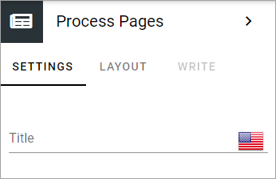

Process Pages block
========================

You use this block to display the pages relevant to the process, that was added on the Pages tab by the process author.

You can add a title for the block and add som padding, if needed.

Layout and Write
*********************
The WRITE Tab is not used here. The LAYOUT tab contains general settings, see: :doc:`General Block Settings </blocks/general-block-settings/index>`
