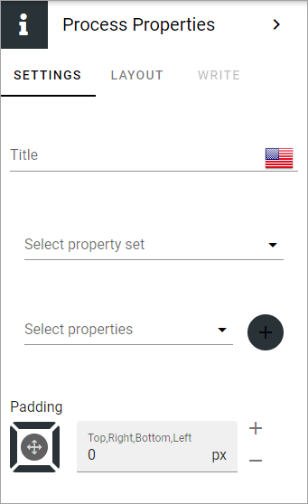

Process properties block
==========================

Use this block to display properties for the process. Process owner is a good example of a property that can make sense to show for end users. 

You can set the following:

+ **Title**: You can add a titel for the block in any or all available languages.
+ **Select property set**: You can select a property set to choose properties from here. Then the list of properties below will show only the properties that belongs to the set. If no property set is selected, the list below will display all available properties.
+ **Select properties**: Select a property from this list. You can add several properties, but just one at a time. Click the plus to add additional properties.
+ **Padding**: You can set some padding if needed.

When you have added a property, you can choose to show the propertie's label:

.. image:: process-properties-block-label.png

Layout and Advanced
********************
The tabs Layout and Advanced are standard tabs, available for most blocks. For more information, see: :doc:`General block settings </blocks/general-block-settings/index>`
