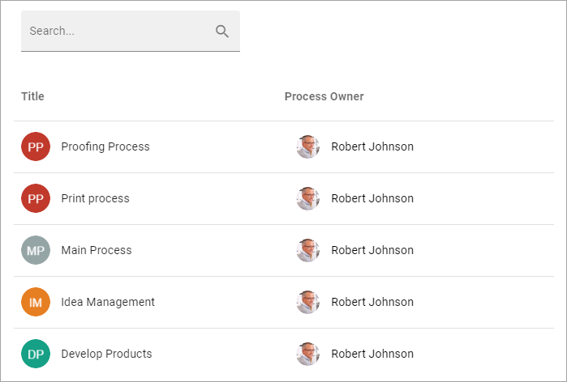
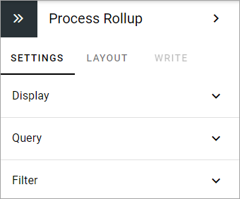
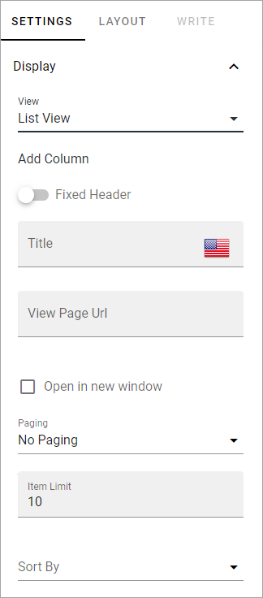
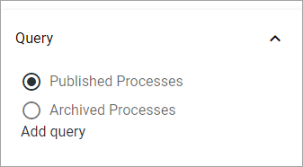
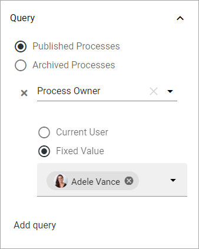
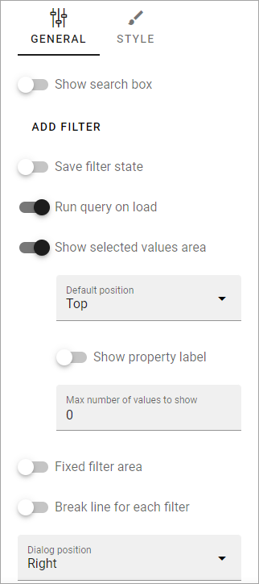

Process Rollup block
========================

Use the Process Rollup block for a list of available processes. To display processes when a user clicks a process you don't have to set up specific pages if you don't want to. You can use the system page for processes that is always available.

Note that this block is found in the "Content Rollup" catagory, not the "Porcess Information" category.

Here's an example of a Process Rollup:

The settings
*************
Use these settings for the block:

Display
---------
The following settings are available for Display:

Note that you have select List View för the options to show up, even if that's the only available view.

(All options are not shown in the image but described below.)

+ **Add Column**: Add the columns for the information to be shown on the list. At least one column must be added or nothing will be shown.
+ **Adjust Columns**: (Displayed when you are adding columns.) Use this option for the order in which the selected columns are shown, left to right.
+ **Fixed header**: Select this option for the header to always be shwon when scrolling. This option is available in Omnia 7.0 and later.
+ **Title**: If variatons exists for the page, you can only set the title in the default language. Titles in other languages are set in the variations. If no variations exists, it looks like in the image above, and you can add a title in any or all available languages. 
+ **View Page Url**: If you have created a page that will be used to display any process when a user clicks on it, add the Url to the page here. Note that you don't have to create a page for this purpose. If you don't, a system page will be used.
+ **Open in a new window**: Select this option if the clicked process should be opened in a new window.
+ **Paging**: Select how paging should work; “No Paging”, “Classic” or “Scroll”. 
+ **Item Limit**: To limit the number of processes being displayed per "page", add a fixed number here. Works together with Paging.
+ **Sort By**: Select the property to sort the list by.
+ **Descending/Ascending**: Select Descending or Ascending sorting here.
+ **No Result Text**: To show a specific text when there is nothing to display in the rollup, add the text here.
+ **Padding**: Add some padding if nedded.

Query
---------
Select to display published processes or archived processes.

If all published or archived processes should be available in the list, that's it, you don't need to actually add a query.

If just some of the processes should be displayed, add one or more queries this way:

1. Select property for the query.
2. Use the additonal settings available.

Here's an example:

Filter
------
If users should be able to filter the list, use these options to add filters.

See this page for more information on how to add filters to a block: :doc:`Filter UI </blocks/general-block-settings/filters/index>`

In Omnia 7.0 and later, new options for filtering can be available, see: :doc:`Filter options for blocks in Omnia 7.0 </blocks/general-block-settings/filter-options-block/index>`

Layout and Write
*********************
The WRITE Tab is not used here. The LAYOUT tab contains general settings, see: :doc:`General Block Settings </blocks/general-block-settings/index>`

