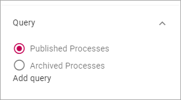

Process Rollup block
========================

Use the Process Rollup block for a list of available processes. To display processes when a user clicks a process you don't have to set up specific pages if you don't want to. You can use the system page for processes that is always available.

Here's an example of a Process Rollup:

.. image:: process-rollup-block-example.png

The settings
*************
Use these settings for the block:

.. image:: process-rollup-block-settings.png

Display
---------
The following settings are available for Display:

.. image:: process-rollup-block-settings-display.png

+ **Add Column**: Add the columns for the information to be shown on the list. Add at least one column must be added or nothing will be shown.
+ **Adjust Columns**: (Displayed when you are adding columns.) Use this option for the order in which the selected columns are shown, left to right.
+ **Title**: You can add a title for the list in any or all availble languages. 
+ **View Page Url**: If you have created a page that will be used to display any process when a user clicks on it, add the Url to the page here. Note that you don't have to create a page for this purpose. If you don't, a system page will be used.
+ **Open in a new window**: Select this option if the clicked process should be opened in a new window.
+ **Paging**: Select how paging should work; “No Paging”, “Classic” or “Scroll”. 
+ **Page Size**: To limit the number of processes being displayed per "page", add a fixed number here. Works together with Paging.
+ **Sort By**: Select the property to sort the list by.
+ **Descending/Ascending**: Select Descending or Ascending sorting here.
+ **Padding**: Add some padding if nedded.

Display
---------
Select to display published processes or archived processes.

If all published or archived processes should be available in the list, that's it, you don't need to actually add a query.

If just some of the processes should be displayed, add a query the same way as in other similar Rollup blocks.

Filter
------
If users should be able to filter the list, use these options to add filters.

See this page for more information on how to add filters to a block: :doc:`Filter UI </blocks/general-block-settings/filters/index>`

Layout and Advanced
********************
The tabs Layout and Advanced are standard tabs, available for most blocks. For more information, see: :doc:`General Block Settings </blocks/general-block-settings/index>`

