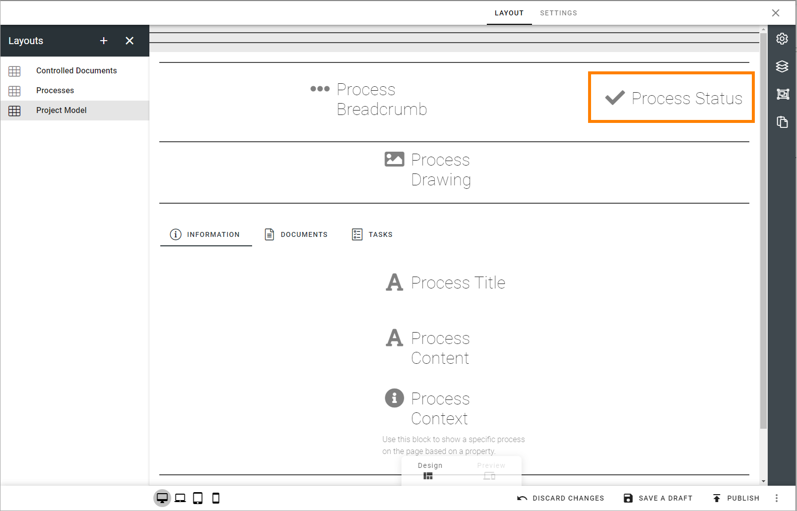

Process status block
=======================================

This block is available in Omnia 6.12 and later. It can be used in a process context to set and view the status for a step in the process.  Mainly for use in Teams.

Here's an user example. The user selcts a process step and can then see or edit the status for that step.

.. image:: process-status-user.png

As an administrator you place the block when creating/editing a layout for a process page.

There are no settings for the block.

