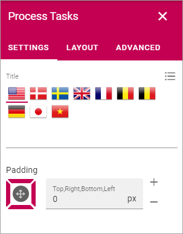

Process tasks block
=======================

Use this block to display tasks the process author added (on the Tasks tab) for the process. 

You can add a title for the block and add some padding, if needed.

+ **Enable assignments for tasks**: If you are using Microsoft Planner you can choose to activate assignment for tasks in this block. If you don't use Planner, this is just a To do-list that can't be assigned.

Layout and Write
*********************
The WRITE Tab is not used here. The LAYOUT tab contains general settings, see: :doc:`General block settings </blocks/general-block-settings/index>`

