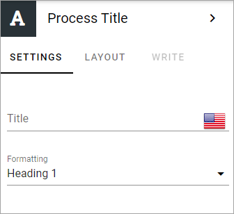

Process title block
=====================

Use this block to display the process title (added for the process by the process author).

You can add a block title (in that case shown over the process title) and select formatting for the process title.

Layout and Write
*********************
The WRITE TAB is not used here. The LAYOUT tab contains general settings, see: :doc:`General block settings </blocks/general-block-settings/index>`

